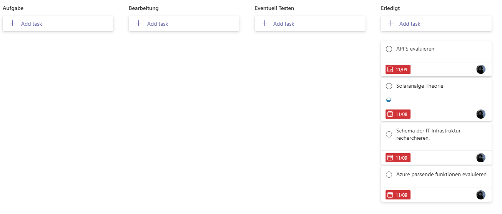

# Projektmanagment

[[_TOC_]]

## Kanban Software

Bevor ich mit meiner Arbeit beginnen kann, ist es wichtig, die richtige Software auszuwählen. Nach sorgfältiger Evaluation verschiedener Kanban-Tools habe ich mich für Microsoft Planner entschieden. Diese Wahl basiert auf der höchsten Punktzahl in meiner Nutzwertanalyse. Zudem ermöglicht Microsoft Planner den Dozenten einen klaren und einfachen Einblick in den Fortschritt der Arbeit.

## Woche 1

In der erste woche habe ich mit der Planung angefangen. Ich konnte leider nicht alles erledigen da ich aus Organisatorischen gründen keine Zeit hatte.   

**Ziele für nächste Woche:**
- Abschluss der Recherche zu den technischen Aspekten.  
- Beschaffung der benötigten Sachmittel.  

## Woche 2

In der zweiten Woche konnte ich die Planung erfolgreich abschliessen. Die Umsetzung des Projekts hat nun begonnen, und die notwendigen Sachmittel wurden beschafft. Ich werde in Zukunft die erledigten Tasks regelmässig abhaken, um den Fortschritt klar zu dokumentieren. Dies ist wichtig, da sich die Liste der Aufgaben stetig erweitert.  

**Ziele von letzte Woche:**
- Die Sachmittel wurden beschafft.
- Recherche der Technische Aspekten wurde erfolgreich beendet.

**Ziele für nächste Woche:**
- Mit den Python Script anfangen
- Gitlab Repository überarbeiten

## Woche 3

In der dritten Woche habe ich mit der Entwicklung des Python-Skripts begonnen und bereits gute Ergebnisse erzielt. Als nächstes werde ich mich mit der Integration der SMS-API beschäftigen, um den Funktionsumfang des Skripts weiter auszubauen. Ausserdem habe ich mit meinem Dozenten gesprochen und beschlossen, ab sofort nur noch einen Screenshot pro Woche hochzuladen.

**Ziele von letzte Woche:**
- Der erste Python Script wurde geschrieben.
- Vom Gitlab Repo wurde überarbeitet.

**Ziele für nächste Woche:**
- Die Output-Skripte erfolgreich zu einem einzigen Skript kombinieren.  
- Das kombinierte Skript mit Azure-Diensten verknüpfen.  

## Woche 4

In dieser Woche konnte ich leider nicht an meinem Projekt arbeiten, da ich keine Zeit hatte.  

## Woche 5

In der fünften Woche ist mir aufgefallen, dass der Benutzer die Möglichkeit haben sollte, auszuwählen, welche Wetterdaten er erhalten möchte. Dies hatte ich zuvor übersehen und muss nun überlegen, wie ich diese Funktion umsetzen kann. Leider konnte ich in dieser Woche nicht viel an meinem Projekt arbeiten.

**Ziele von der vor letzte Woche:**
- Der SMS/Email Notifier Script wurde erfolgreich erstellt.

**Ziele für nächste Woche:**
- Ein Konzept entwickeln, wie der Benutzer individuell auswählen kann, welche Wetterdaten er erhalten möchte.
- Die Arbeit am Projekt fortsetzen, um den Rückstand aufzuholen.

## Woche 6

In dieser woche konnte ich viele sachen erledigen. Die funktion womit der Benutzter die Wetterdaten erhalten kann wurde erfolgreich implementiert. Soauch das der User eine Statistik bekommt wenn der skript abläuft. Ein Cronjob mit Azure Function wurde auch implementiert.

**Ziele von der vor letzte Woche:**
- Azure Cron job Funktion mit den Script wurde erfolgreich implementiert.
- Die Wetter funktion kann man jetzt selber auswählen.

**Ziele für nächste Woche:**
- Da ich jetzt schon fast fertig mit mein projekt bin, wird jetzt auf die testing phase sehr viel aufmerksankeit geschenkt.
- Der Gitlab Repository wird besser formatiert

## Woche 7

Während der Entwicklung traten einige unerwartete Probleme auf, darunter ein Fehler im PyCharm-Editor. Dieses Problem konnte erfolgreich behoben werden. Zusätzlich habe ich das GitLab-Repository optimiert und alle sensiblen Daten im Text zensiert. Einige Screenshots müssen jedoch noch entsprechend anonymisiert werden.

Der Cron-Job des Azure Functions Timers funktioniert ebenfalls wie erwartet. Ich habe regelmässig um 06:30 Benachrichtigungen erhalten, was vermutlich auf eine abweichende Zeitzone zurückzuführen ist. Daher habe ich den Timer auf 04:30 angepasst, um sicherzustellen, dass die Benachrichtigungen zur gewünschten Zeit eintreffen.

**Ziele von der vor letzte Woche:**
- Die Sensible Inhalte wurden Zensiert.
- Gitlab Repo wurde angepasst.

**Ziele für nächste Woche:**
* Screenshots Zensieren.
* Powerpoint erstellen

## Woche 8

In dieser Woche habe ich an meine Semesterarbeit nicht gearbeitet.

## Woche 9

Woche 8 war leider nichts. Ich hatte leider keine Zeit. Ich habe die vorherige aufgaben von Woche 7 in diese Woche erledigt.

**Ziele von der vor letzte Woche:**
- Die nötigen Screenshots wurden Zensiert.
- Die erstellung der Powerpoint Präsentation wurde begonnen. 

**Ziele für nächste Woche:**
- Die Reflexion muss noch geschrieben werden.
- Powerpoint Präsentation muss fertig sein.

## Woche 10
Das ende nähert sich. Ich bin immernoch an der Powerpoint Präsentation dran. Da ich noch spiezielle bedürfnisse für meine Folien habe, braucht es noch ein bisschen mehr Zeit bis ich fertig bin. Aber die Grundstruktur ist fertig.

**Ziele von der vor letzte Woche:**
- Das Schreiben von der Reflexion wurde erledigt.
- Die PowerPoint-Präsentation ist fertig.

**Ziele für nächste Woche**
- Mit der Semesterarbeit Fertig sein
- Für die Powerpoint Präsentation üben

## Woche 11
Dies ist die letzte Woche, in der ich an meiner Semesterarbeit arbeite. Mein Fokus lag dabei hauptsächlich auf der Erstellung der PowerPoint-Präsentation.
**Ziele von der vor letzte Woche:**
- Powerpoint Präsentation ist fertig.
- Semesterarbeit ist nach meine sicht abgeschlossen.

**Ziele für nächste Woche**
- Das die Semesterarbeit erledigt ist.

## Semesterarbeit - Zeitplan und Fortschritt
