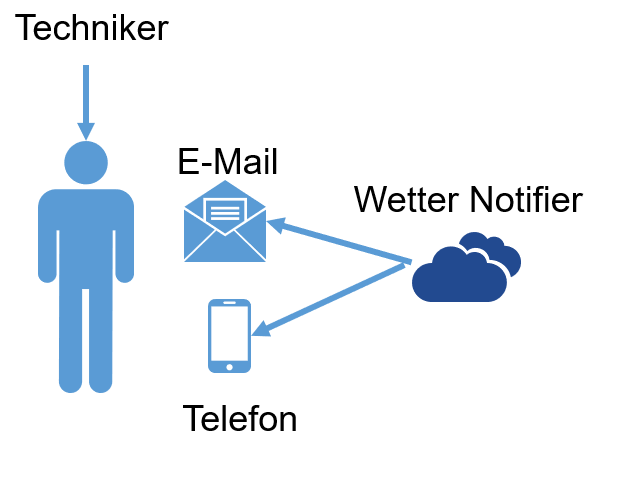

# SemesterArbeit_2

## Problemstellung ⚠️

Musterfirma AG betreibt mehrere Solarparks, deren Leistung und Sicherheit stark von den lokalen 
Wetterbedingungen abhängen. Unwetterereignisse wie Hagel, Starkregen oder Sturmböen können 
erhebliche Schäden an den Solaranlagen verursachen und die Effizienz der Energieproduktion 
beeinträchtigen. Derzeit fehlen jedoch die notwendigen Strukturen, um Wetterbedingungen in Echtzeit 
zu überwachen und das Wartungsteam rechtzeitig vor potenziellen Gefahren zu warnen. Dies führt 
dazu, dass Schäden erst entdeckt werden, wenn es bereits zu Ausfällen oder Leistungsverlusten 
gekommen ist, was mit hohen Reparaturkosten und möglicherweise langwierigen 
Betriebsunterbrechungen einhergeht. 

Um dies zu verhindern, benötigt Musterfirma AG ein intelligentes Wetter- und 
Ereignisbenachrichtigungssystem, das Wetterdaten kontinuierlich auswertet, gefährliche 
Wetterbedingungen erkennt und das Wartungsteam frühzeitig über potenzielle Risiken informiert. Das 
System soll zudem individuell konfigurierbar sein, damit die Techniker nur relevante und personalisierte 
Warnungen erhalten. Ein automatisiertes Benachrichtigungssystem, das kritische Ereignisse per E-Mail 
und in akuten Fällen zusätzlich per SMS kommuniziert, soll die Reaktionszeit verkürzen und das 
Wartungsteam in die Lage versetzen, gezielte Massnahmen zu ergreifen, bevor Schäden entstehen.

{ width=300px }

## Ziele 🎯 

1.  **Kontinuierliche Wetterüberwachung:** Sicherstellung einer fortlaufenden Überwachung der 
Wetterbedingungen an den Standorten der Solarparks, um kritische Wetterereignisse frühzeitig 
zu erkennen. 

2. **Automatisierte Ereignisbenachrichtigung:** Entwicklung eines Systems zur automatisierten 
Benachrichtigung des Wartungsteams bei Wetterbedingungen, die potenziell Schäden an den 
Anlagen verursachen könnten. 

3. **Individuelle Benachrichtigungseinstellungen:** Ermöglichung des Wartungsteams, ihre 
Benachrichtigungseinstellungen individuell anzupassen und relevante Wetterkriterien sowie 
Standort auszuwählen. 

4. **Integration eines Notfall-Alarmsystems:** Bereitstellung einer Methode, das Wartungsteam im 
Falle besonders kritischer Wetterereignisse per SMS zu alarmieren, um sicherzustellen, dass 
auch abwesende Mitarbeiter rechtzeitig reagieren können.

## Terminplan 🗓️

**Woche 1-2:** Planung des Projektes 

**Woche 3-4:** Entwicklung der Kernfunktionen 

**Woche 5:** Automatisierung und E-Mail/SMS-Benachrichtigung 

**Woche 6-8:** Tests und Optimierung 

**Woche 9-12:** Dokumentation und Deployment

## Sachmittel 🛠️ 

1. Wetter API 
2. Python 
3. Code Editor 
4. Azure 

## Vorgaben, Methoden und Werkzeuge 📋 🧰 

In dieser Semesterarbeit beabsichtige ich, mit der Kanban-Methode zu arbeiten und dabei auch Azure 
einzusetzen. Die Einhaltung des 12-wöchigen Projektzeitrahmens mit regelmässigen Überprüfungen 
des Fortschritts wird vorgenommen. Ich sollte jeden Morgen um 05:30 eine E-Mail 
Benachrichtigung bekommen. 

## Risiken ⚡
1. API-Verfügbarkeit 
2. Fehlende Dokumentation 
3. Komplexität der Automatisierung 
4. Fehlende E-Mail/SMS-Benachrichtigungen 
