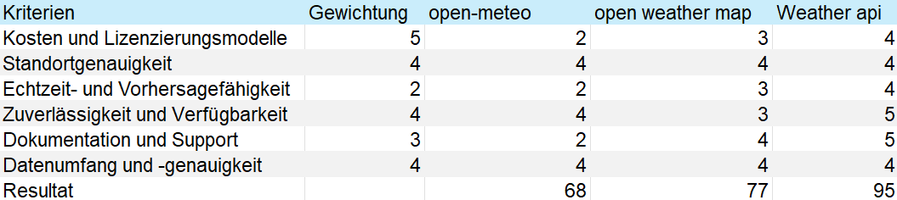
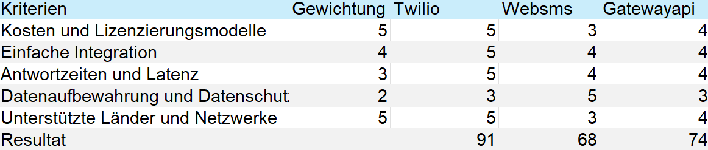
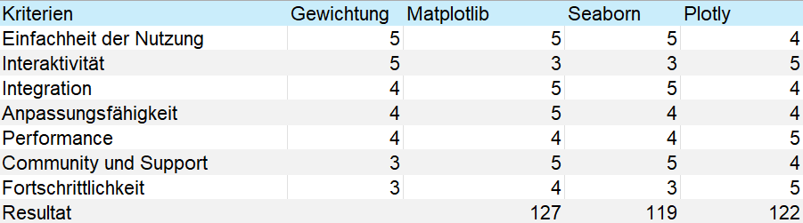

# Einführung zur Nutzwertanalyse

Die Auswahl der richtigen Sachmittel für ein Projekt ist eine entscheidende Grundlage für den Erfolg und die Effizienz der Umsetzung. Um diese Auswahl so fundiert und logisch wie möglich zu gestalten, habe ich mich für die **Nutzwertanalyse** als Entscheidungsmethode entschieden.

Die Nutzwertanalyse ermöglicht es, verschiedene Alternativen systematisch und nachvollziehbar miteinander zu vergleichen, indem sie anhand definierter Kriterien bewertet und gewichtet werden. Diese Methode hilft, sowohl objektive Faktoren wie Funktionalität und Kosten als auch subjektive Präferenzen wie Benutzerfreundlichkeit oder Design zu berücksichtigen.

#### **Vorteile der Nutzwertanalyse**
- **Strukturierter Entscheidungsprozess:**  
  Die Nutzwertanalyse führt durch einen klaren Bewertungsprozess, der alle relevanten Kriterien einbezieht.
  
- **Transparenz:**  
  Die Gewichtung und Bewertung der Kriterien macht die Entscheidungsfindung nachvollziehbar und begründet.
  
- **Flexibilität:**  
  Unterschiedliche Alternativen können unabhängig von ihrer Art oder Anzahl in die Analyse einbezogen werden.
  
- **Logische Priorisierung:**  
  Durch die Gewichtung der Kriterien wird sichergestellt, dass wichtige Anforderungen stärker berücksichtigt werden.

#### **Fazit**
Durch den Einsatz der Nutzwertanalyse in meinem Projekt konnte ich sicherstellen, dass ich die besten Sachmittel basierend auf meinen spezifischen Anforderungen auswähle, und gleichzeitig eine fundierte und dokumentierte Entscheidung treffe.

# Wetter API Evaluation
Ich habe die gängigsten Wetter-APIs umfassend analysiert, und die Weather API hat sich dabei als klare Favoritin herauskristallisiert. Besonders überzeugt haben mich das Preis-Leistungs-Verhältnis sowie die hervorragend strukturierte Dokumentation. Die API erfüllt sämtliche Anforderungen für dieses Projekt und passt ideal zu unseren Zielen.

# SMS API Evaluation

Die Wahl von Twilio als SMS-API basiert auf seiner Kombination aus Zuverlässigkeit, Benutzerfreundlichkeit, Flexibilität und Sicherheitsstandards. Twilio erfüllt nicht nur meine funktionalen Anforderungen, sondern bietet auch einen hervorragenden Support und eine bewährte Infrastruktur. Diese Aspekte machen Twilio zur idealen Lösung für die Implementierung von SMS-Benachrichtigungen in meinem Projekt.

# Statistische Visualisierung
Die Wahl von Matplotlib basiert auf einer Kombination aus Benutzerfreundlichkeit, Flexibilität, Integration und Verlässlichkeit. Während andere Bibliotheken wie Plotly oder Seaborn ebenfalls hervorragende Funktionen bieten, erfüllt Matplotlib die spezifischen Anforderungen meines Projekts am besten. Besonders die Möglichkeit, anpassbare und statische Visualisierungen zu erstellen, war ein entscheidender Faktor für meine Entscheidung.

