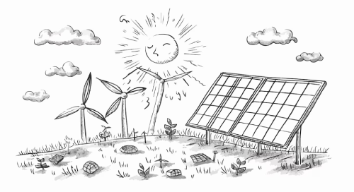
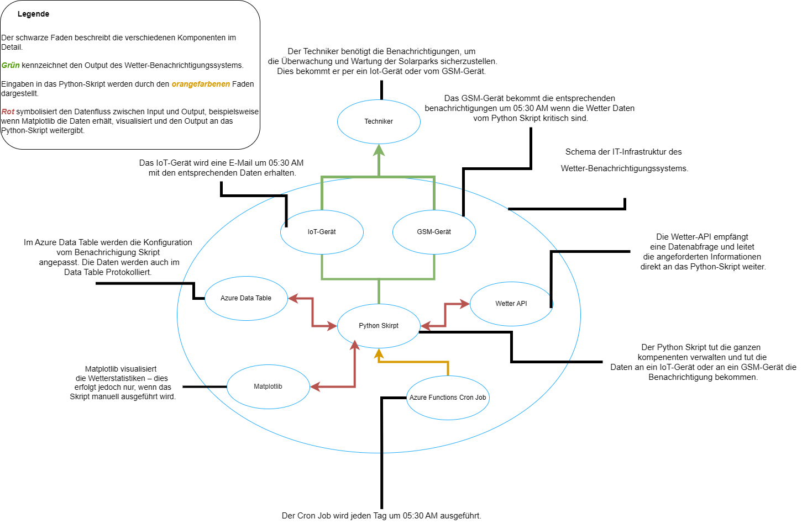

## Theorie zu den verschiedenen Komponenten

__TOC__ 

## Was sind die schlechten Wetterbedingungen für Solaranlagen?
Der Grund, warum ich diesen Abschnitt in meine Theorie einbeziehe, liegt darin, dass mein Wetter-Notifier die verschiedenen Wettereigenschaften berücksichtigen muss. Es ist entscheidend, zu verstehen, welche relevanten Daten tatsächlich beim Empfänger ankommen.

### 1.  Bewölkungsgrad ☁️
-  **Wirkung:** Dichte Wolken und Nebel blockieren das Sonnenlicht, was die Stromproduktion erheblich reduziert. Solarmodule funktionieren zwar auch bei diffusem Licht, aber die Leistung ist dann deutlich geringer als bei  direkter Sonneneinstrahlung. <br>
- **Effekt:** Ertragsminderung, je nach Bewölkungsdichte können 10-80 % weniger Energie erzeugt werden.

### 2.  Wetterbedingungen 🌧️
- **Wirkung:** Allgemeine Wetterbedingungen (z. B. Regen, Sturm) können Hinweise auf potenzielle Risiken für die Solaranlage geben, wie z. B. Beschädigungen durch Hagel oder Feuchtigkeitseintritt. <br>
- **Effekt:** Planen von Wartungseinsätzen bei sicherem Wetter und Vermeidung von Risikobedingungen.

### 3. Luftfeuchtigkeit 💧
- **Wirkung:** Hohe Luftfeuchtigkeit kann die Leistung von Solaranlagen beeinträchtigen, insbesondere durch die Bildung von Kondenswasser auf Modulen und elektrischen Bauteilen. <br>
- **Effekt:** Verhindern von Schäden durch frühzeitige Inspektion oder Anpassung der Betriebsbedingungen.

### 4. Luftdruck 🌬️
- **Wirkung:** Luftdruckänderungen können Wetterumschwünge signalisieren, die für Wartungs- und Reparaturpläne berücksichtigt werden müssen.
- **Effekt:** Früherkennung von Wetterveränderungen, die die Arbeitssicherheit beeinflussen könnten.
### 5. Temperatur 🌡️
- **Wirkung:** Extreme Temperaturen beeinflussen die Effizienz der Solaranlagen und können zu Überhitzung oder Funktionsstörungen führen.
- **Effekt:** Überwachung der Temperaturen, um präventive Maßnahmen wie Kühlung oder Abschaltung einzuleiten.

### 6. UV-Strahlung ☀️
- **Wirkung:** Die UV-Strahlung ist entscheidend für die Energieproduktion der Solaranlagen. Sie gibt Aufschluss über die erwartete Leistung bei klarem Himmel. <br>
- **Effekt:**  Berechnung der Energieproduktion und Bewertung von Leistungsminderungen bei geringem UV-Wert.

### 7. Sichtweite 👁️
- **Wirkung:** Die Sichtweite gibt Hinweise auf Nebel oder andere atmosphärische Bedingungen, die die Sonneneinstrahlung reduzieren können. <br>
- **Effekt:** Abschätzung der Energieproduktion und Planung von Wartungsarbeiten unter sicheren Bedingungen.


## Begründung der Wetterbedingungen

### Hohe Wolkenbedeckung (≥ 6 Oktas)
- **Begründung:**  
  Wolkenbedeckung wird in Oktas gemessen (0 = klar, 8 = vollständig bedeckt). Bei ≥ 6 Oktas ist der Himmel zu mindestens 75 % bedeckt, was die Sonneneinstrahlung erheblich reduziert. Der Schwellenwert von 6 Oktas wurde gewählt, da er signifikante Leistungsminderungen signalisiert.

---

### Geringe UV-Strahlung (< 20 mW/m²)
- **Begründung:**  
  UV-Strahlung unter 20 mW/m² ist oft nicht ausreichend für die effiziente Stromproduktion. Diese Schwelle ermöglicht es, Leistungseinbußen frühzeitig zu erkennen.

---

### Hohe Luftfeuchtigkeit (> 80 %)
- **Begründung:**  
  Luftfeuchtigkeit über 80 % kann Kondensation verursachen, was Korrosion und Leistungsverlust zur Folge hat. Diese Grenze wird häufig als kritisch angesehen.

---

### Extreme Temperaturen (< -5°C oder > 40°C)
- **Begründung:**  
  Solaranlagen sind in der Regel für Temperaturen zwischen -5°C und 40°C ausgelegt. Werte außerhalb dieses Bereichs können Materialschäden oder Überhitzung verursachen.

---

### Geringe Sichtweite (< 2 km)
- **Begründung:**  
  Nebel oder Dunst, die Sichtweiten unter 2 km verursachen, reduzieren die Sonneneinstrahlung erheblich und erhöhen die Risiken bei Wartungsarbeiten.

---

### Niedriger Luftdruck (< 980 mbar)
- **Begründung:**  
  Luftdruck unter 980 mbar deutet auf schlechte Wetterbedingungen wie Stürme hin. Diese Schwelle ermöglicht frühzeitige Warnungen und präventive Maßnahmen.

---

### Schlechtes Wetter (Regen, Schnee, Gewitter)
- **Begründung:**  
  Regen, Schnee oder Gewitter beeinträchtigen nicht nur die Effizienz, sondern erhöhen auch die Risiken bei Wartungsarbeiten erheblich.

---

## Zusammenfassung
Die Schwellenwerte wurden basierend auf meteorologischen Standards und technischen Anforderungen gewählt. Sie ermöglichen eine effektive Erkennung und Meldung kritischer Wetterbedingungen, um Effizienzverluste und Risiken zu minimieren.





# Theorie zur API

### Theorie zur Wetter-API und deren Zusammenhang mit der Semesterarbeit

Eine Wetter-API ist eine Programmierschnittstelle, die Echtzeit-Wetterdaten sowie historische und prognostizierte Wetterinformationen bereitstellt. APIs wie WeatherAPI, oder ähnliche Dienste ermöglichen Entwicklern, Wetterdaten programmgesteuert abzurufen und in Anwendungen zu integrieren. Die bereitgestellten Informationen umfassen typischerweise Temperatur, Luftfeuchtigkeit, Windgeschwindigkeit, Bewölkungsgrad, Niederschlagsmengen, UV-Strahlung und andere meteorologische Parameter.

#### Funktionsweise einer Wetter-API
Die Wetter-API funktioniert durch das Senden von HTTP-Anfragen an einen Server, der die gewünschten Daten bereitstellt. Diese Anfragen enthalten spezifische Parameter wie:
- **Standort**: Der geografische Ort, für den die Wetterdaten benötigt werden (z. B. Stadtname oder Koordinaten).  
- **Zeitraum**: Echtzeitdaten, Vorhersagedaten oder historische Daten.  
- **Datenumfang**: Zusatzinformationen wie Luftqualität oder Unwetterwarnungen.  

Die API liefert die angeforderten Daten in standardisierten Formaten wie JSON oder XML zurück, die dann von Programmen verarbeitet werden können.

#### Relevanz der Wetter-API für die Semesterarbeit
Die Wetter-API spielt eine zentrale Rolle in dieser Semesterarbeit, da sie die Grundlage für das geplante Wetter- und Ereignisbenachrichtigungssystem bildet. Ohne die kontinuierliche und zuverlässige Bereitstellung von Wetterdaten durch die API wäre es nicht möglich, die Ziele des Projekts zu erreichen.

**Zusammenhang mit der Semesterarbeit:**
1. **Kontinuierliche Wetterüberwachung**  
   Die API ermöglicht die fortlaufende Überwachung der Wetterbedingungen an den Standorten der Solarparks. Sie stellt die Daten bereit, die für die Erkennung kritischer Wetterereignisse wie Hagel, Sturmböen oder Starkregen erforderlich sind.

2. **Analyse gefährlicher Wetterbedingungen**  
   Die Wetterdaten der API werden durch Python-Skripte analysiert, um spezifische Kriterien zu prüfen (z. B. Windgeschwindigkeit über einem Schwellenwert oder Niederschlagshöhe). Diese Auswertung bildet die Grundlage für die Erkennung von potenziellen Gefahren.

3. **Automatisierte Benachrichtigungen**  
   Basierend auf den von der API gelieferten Wetterdaten werden E-Mail- und SMS-Benachrichtigungen generiert. Die API sorgt dafür, dass die Informationen stets aktuell und zuverlässig sind.

4. **Individualisierung der Benachrichtigungen**  
   Durch die API können unterschiedliche Wetterkriterien flexibel abgerufen werden, sodass das Wartungsteam personalisierte Einstellungen vornehmen kann. Beispielsweise könnten bestimmte Techniker nur für Sturmböen oder UV-Strahlung benachrichtigt werden.

5. **Integration in Azure**  
   Die Daten der Wetter-API werden innerhalb der Azure-Plattform verarbeitet und mit den Azure-Diensten wie Azure Functions kombiniert, um eine skalierbare und automatisierte Lösung zu erstellen.

Die Wetter-API ist somit ein unverzichtbarer Baustein des gesamten Systems, da sie die benötigten Daten bereitstellt und die Automatisierung der Prozesse unterstützt. Durch die sorgfältige Auswahl und Nutzung der API wird sichergestellt, dass das Projekt seine Ziele erreicht und einen hohen Mehrwert für die Solarparks von PPC Metrics AG bietet.
.png)


# Schema des IT-Projekts

Für die Visualisierung des IT-Schema-Projekts habe ich mich für ein **Seusag-Diagramm** entschieden, da es meiner Meinung nach die beste Methode war, die Informationen klar und strukturiert darzustellen. Ich habe ebenfalls versucht, das Projekt mit einem **Flussdiagramm** und einem **UML-Diagramm** zu visualisieren. 

Beim Flussdiagramm hatte ich Schwierigkeiten, die parallelen Abläufe und verschiedenen Komponenten, die gleichzeitig ausgeführt werden, übersichtlich darzustellen. Das UML-Diagramm empfand ich als nicht ausreichend umfangreich für die Komplexität des Projekts. 

Die farblichen Pfade und die klare Struktur des Seusag-Diagramms waren hingegen sehr hilfreich und boten eine gut verständliche und detaillierte Darstellung. Aus diesem Grund habe ich mich letztendlich für das Seusag-Diagramm entschieden.



# Azure Functions Timer Trigger – Theoretische Grundlagen und Projektintegration
**Was ist Azure Functions?**<p>
Azure Functions ist ein serverloser Cloud-Dienst von Microsoft Azure, der es ermöglicht, kleine Code-Snippets (Funktionen) zu erstellen und auszuführen, ohne sich um die Verwaltung von Servern kümmern zu müssen.

**Vorteile:**
* Skalierung nach Bedarf
* Kosteneffizienz (Bezahlung nur für die tatsächliche Ausführungszeit)
* Einfache Bereitstellung und Verwaltung

## Timer Trigger – Definition und Funktionsweise
Ein Timer Trigger ist eine Art von Azure Function, die zu einem bestimmten Zeitpunkt oder in festen Zeitintervallen automatisch ausgeführt wird.

Funktionsweise: Der Timer Trigger nutzt eine CRON-Expression, um festzulegen, wann die Funktion ausgeführt wird.<p>
**Beispiel:**
Tägliche Ausführung um 8:00 Uhr:
```
0 0 8 * * * 
```
Alle 30 Minuten:

```
0 */30 * * * * 
```
**Praxisbeispiel:** Eine Timer Function kann jede Stunde Wetterdaten abrufen, Benutzerpräferenzen aus Azure Table Storage prüfen und automatisch Benachrichtigungen senden.

## 3. Relevanz für Wetterbenachrichtigungsprojekte

**Timer-Trigger** sind ideal für Wetterprojekte, da sie regelmässige Aufgaben automatisieren können:

1. **Regelmässiges Abrufen von Wetterdaten**  
   - Die Funktion ruft stündlich oder täglich Wetterdaten von einer API ab.

2. **Vergleich mit Benutzerpräferenzen**  
   - Benutzerdaten (z. B. `cloudy`, `uv`, `humidity`, etc.) werden aus Azure Table Storage geladen und mit den aktuellen Wetterdaten verglichen.

3. **Versand von Benachrichtigungen**  
   - Wenn ein Benutzer beispielsweise bei hoher Luftfeuchtigkeit oder niedrigem UV-Index benachrichtigt werden möchte, wird die Funktion nur dann ausgeführt, wenn diese Bedingungen erfüllt sind.


## 4. Projektintegration – Automatisierte Wetterbenachrichtigungen

**Ziel:**  
Wetterdaten ständig abrufen, mit Benutzerpräferenzen abgleichen und automatisch Benachrichtigungen (E-Mail/SMS) senden.

**Ablauf in deinem Projekt:**

1. **Azure Table Storage**  
   - Speichert die Benutzerpräferenzen (z. B. `cloudy`, `temperature`, `uv`, etc.).  
   - Nutzer können angeben, bei welchen Wetterbedingungen sie benachrichtigt werden möchten.

2. **Timer Trigger (Azure Function)**  
   - Wird in stets Intervallen ausgeführt (z. B. stündlich).  
   - Ruft aktuelle Wetterdaten von einer API ab und vergleicht diese mit den gespeicherten Präferenzen.

3. **Benachrichtigung (E-Mail/SMS)**  
   - Eine Benachrichtigung wird nur dann ausgelöst, wenn die Wetterbedingungen den festgelegten Präferenzen entsprechen.


## 5. Vorteile der Timer Trigger für Wetterprojekte

1. **Automatisierung**  
   - Wetterbenachrichtigungen werden regelmässig und ohne manuelles Eingreifen ausgeführt.

2. **Effizienz**  
   - Die Funktion ist nur dann aktiv, wenn tatsächlich eine Benachrichtigung ausgelöst werden muss, was ressourcenschonend ist.

3. **Skalierbarkeit**  
   - Funktioniert sowohl für eine kleine Anzahl von Benutzern als auch für Tausende ohne Leistungsverlust.

4. **Flexibilität**  
   - Timer Trigger können einfach angepasst werden, um häufiger oder seltener ausgeführt zu werden.


 ## 6. Fazit:
Azure Functions mit Timer Triggern sind perfekt für dein Wetterbenachrichtigungssystem. Sie automatisieren den gesamten Prozess, von der Wetterdatenabfrage bis zur Benachrichtigung, und sind gleichzeitig kostengünstig und flexibel.

Mit dieser Architektur kannst du sicherstellen, dass Benutzer stets über aktuelle Wetterbedingungen informiert werden – und das vollautomatisch.
