# Dokumentation der Arbeit

[[_TOC_]]


# API Script

Da dies mein erster Umgang mit APIs ist, habe ich mich zunächst ausführlich mit deren Funktionsweise vertraut gemacht.
Ich habe meinen API-Schlüssel mit der Postman-Anwendung ausgelesen.

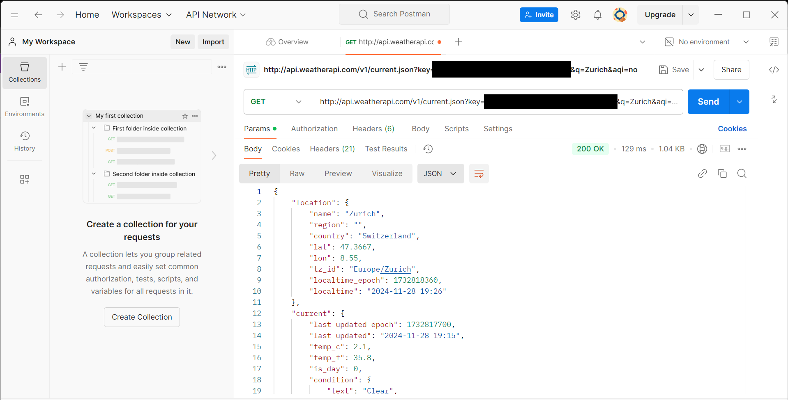{ width=600px }

Der API-Schlüssel kann erfolgreich in ein Python-Skript integriert werden.

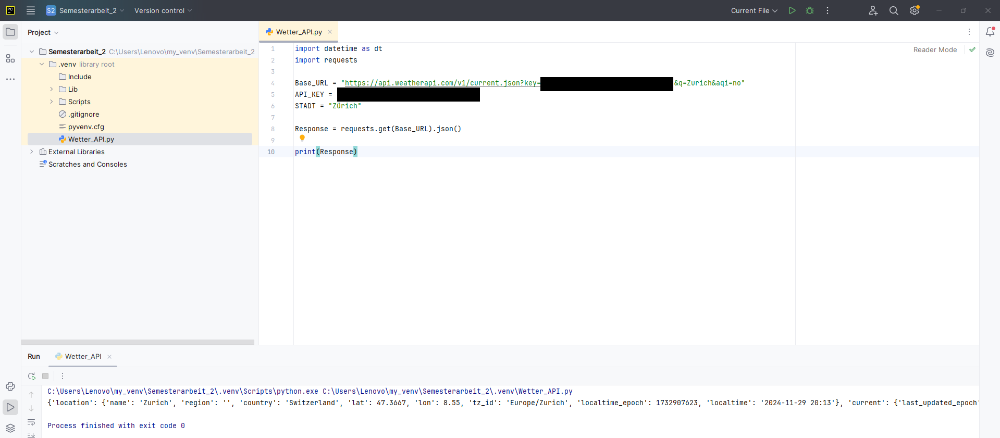{ width=600px }

Dies zeigt den Zustand des ersten Skripts am 30.11.2024

**Aus organisatorischen gründen wird der API Key mit den "x" symbol ausgetauscht.**
``` python 
import datetime as dt
from datetime import datetime
import requests


# API Definieren
Base_URL = "https://api.weatherapi.com/v1/current.json?key=xxxxxxxxxxxxxxxxxxxxxxxxxxxxxxx&q=Zurich&aqi=no&lang=de"
API_KEY = "xxxxxxxxxxxxxxxxxxxxxxxxxxxxxxx"
STADT = "Zürich"

Response = requests.get(Base_URL).json()

# Attribute Defenieren
location_name = Response["location"]["name"]
temperature = Response["current"]["temp_c"]
weather_condition = Response["current"]["condition"]["text"]
cloudy = Response["current"]["cloud"]
UVS = Response["current"]["uv"]
humiditys = Response["current"]["humidity"]
vis_kms = Response["current"]["vis_km"]
pressure_mbs = Response["current"]["pressure_mb"]

#Defining the Time and Date
Time = Response["location"]["localtime"]
Time_Format = datetime.strptime(Time, "%Y-%m-%d %H:%M")
formatted_time = Time_Format.strftime("%H:%M")
formatted_date = Time_Format.strftime("%d-%m-%Y")


print(f"Standort: {location_name}")
print("Zeit:", formatted_time)
print("Datum:", formatted_date)
print(f"Wetterbedingungen: {weather_condition}")
print(f"Temperatur: {temperature}°C")
print(f"Wölkig: {cloudy} Oktas")
print(f"UV Strahlung: {UVS}mW/m²")
print(f"Luftfeuchtigkeit: {humiditys}%")
print(f"Sichtbarkeit: {vis_kms}km")
print(f"Luftdruck: {pressure_mbs}mbs")


# print(Response)

```

# E-Mail Notifier

Als erstes habe ich ein Gmail Konto erstellt, ich habe aus Datenschutz gründen den E-Mail Konto Zensiert.

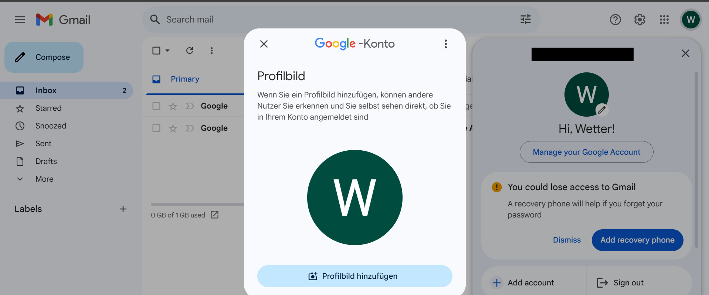

Um mit einem Python-Skript eine E-Mail über Gmail zu versenden, ist es notwendig, ein App-Passwort zu erstellen. Dieses Passwort wird im Skript hinterlegt, damit es E-Mails versenden kann. Zur Erstellung des App-Passworts war es erforderlich, die Zwei-Faktor-Authentifizierung (2FA) zu aktivieren.

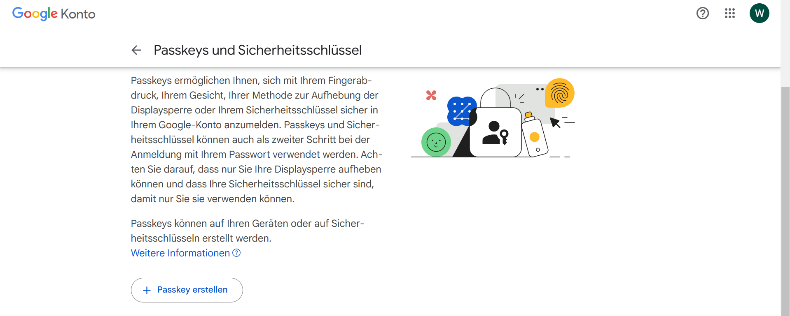

Das folgende Skript implementiert die E-Mail-Benachrichtigungsfunktion.

``` python 

import smtplib
from email.mime.text import MIMEText
from email.mime.multipart import MIMEMultipart

# Gmail-Konto-Konfiguration
GMAIL_USER = "xxxxxxxxxxxxxxxxxxxx"
GMAIL_PASSWORD = "xxxx xxxx xxxx xxxx"


# Funktion zum Senden von E-Mails
def send_email(recipient_email, subject, content):
    """
    Sendet eine E-Mail über Gmail SMTP.

    :param recipient_email: Zieladresse der E-Mail
    :param subject: Betreff der E-Mail
    :param content: Inhalt der E-Mail (Text)
    """
    try:
        # E-Mail-Header und Inhalt erstellen
        message = MIMEMultipart()
        message["From"] = GMAIL_USER
        message["To"] = recipient_email
        message["Subject"] = subject

        # Nachricht anhängen
        message.attach(MIMEText(content, "plain"))

        # Verbindung mit Gmail herstellen
        with smtplib.SMTP("smtp.gmail.com", 587) as server:
            server.starttls()  # Verbindung verschlüsseln
            server.login(GMAIL_USER, GMAIL_PASSWORD)
            server.sendmail(GMAIL_USER, recipient_email, message.as_string())
            print(f"E-Mail erfolgreich an {recipient_email} gesendet.")

    except Exception as e:
        print(f"Fehler beim Senden der E-Mail: {e}")


# Test der Funktion
if __name__ == "__main__":
    # Beispiel-E-Mail senden
    send_email(
        recipient_email="xxxxxxxxxxxxxxxxxxxxxxx",
        subject="Test-Wetterwarnung",
        content="Dies ist eine Testnachricht für die Wetterwarnung."
    )

```

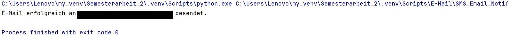

Hier wird der Skript ausgeführt.

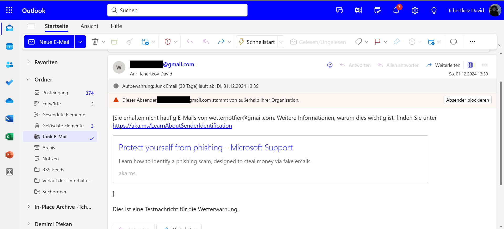


# SMS Notifier 

Für den SMS-Versand habe ich eine geeignete SMS-API verwendet. Nach einer umfassenden Analyse verschiedener Anbieter hat Twilio bei meiner Evaluierung am besten abgeschnitten. Es erfüllte all meine Anforderungen optimal. Zunächst habe ich ein Test-Skript erstellt, und kurz darauf erhielt ich erfolgreich eine SMS.


Der erfolgreiche Test des Skripts ist in folgendem Screenshot dokumentiert.
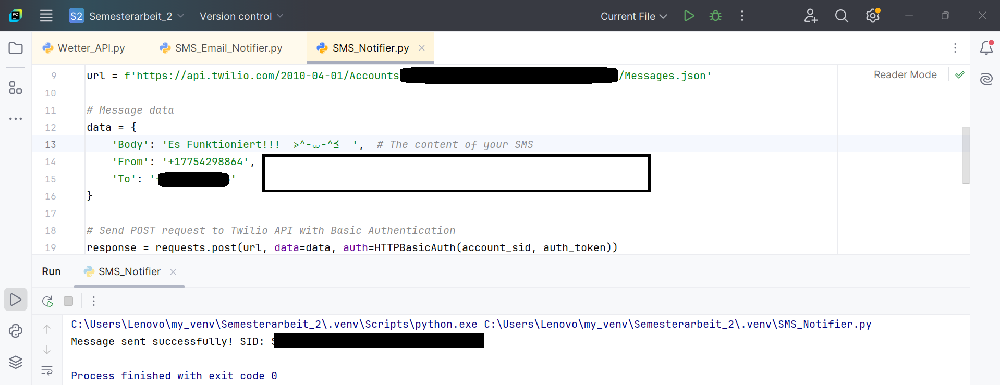


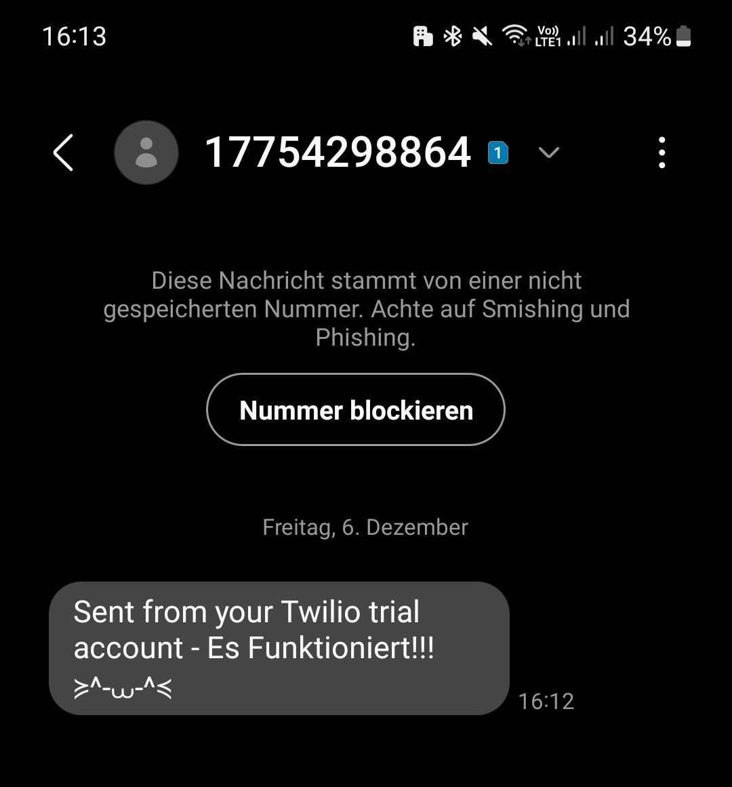{ width=600px }

# Main Skript

Nach der erfolgreichen Implementierung der Skripte für die Wetter-API, SMS-Benachrichtigungen und den E-Mail-Versand konzentrierte ich mich auf die Entwicklung des Hauptskripts.

``` python 
import datetime as dt
from datetime import datetime
import requests
import smtplib
from email.mime.text import MIMEText
from email.mime.multipart import MIMEMultipart
from requests.auth import HTTPBasicAuth

# === Weather API Configuration ===
API_URL = "https://api.weatherapi.com/v1/current.json"
API_KEY = "xxxxxxxxxxxxxxxxxxxxxxxxxxxxxxx"
CITY = "Zurich"

# === Gmail Configuration ===
GMAIL_USER = "xxxxxxxxxxxxxxxxxxxx"
GMAIL_PASSWORD = "xxxx xxxx xxxx xxxx"

# === Twilio Configuration ===
TWILIO_ACCOUNT_SID = "xxxxxxxxxxxxxxxxxxxxxxxxxxxxxxxxxx"
TWILIO_AUTH_TOKEN = "xxxxxxxxxxxxxxxxxxxxxxxxxxxxxxxx"
TWILIO_PHONE_NUMBER = "+17754298864"
RECIPIENT_PHONE_NUMBER = "+xxxxxxxxxx"


# === Function to Fetch Weather Data ===
def fetch_weather(api_url, api_key, city):
    """
    Fetch weather data from the WeatherAPI.
    """
    params = {
        "key": api_key,
        "q": city,
        "aqi": "no",
        "lang": "de"
    }
    response = requests.get(api_url, params=params)
    response.raise_for_status()
    return response.json()


# === Function to Check Weather Conditions ===
def check_weather_conditions(weather_data):
    """
    Check weather conditions and identify if notification is needed.
    """
    location_name = weather_data["location"]["name"]
    temperature = weather_data["current"]["temp_c"]
    weather_condition = weather_data["current"]["condition"]["text"]
    cloudy = weather_data["current"]["cloud"]
    UVS = weather_data["current"]["uv"]
    humiditys = weather_data["current"]["humidity"]
    vis_kms = weather_data["current"]["vis_km"]
    pressure_mbs = weather_data["current"]["pressure_mb"]

    notification_needed = False
    reasons = []

    # Criteria for bad weather
    if cloudy >= 6:
        notification_needed = True
        reasons.append("Hohe Wolkenbedeckung (>= 6 Oktas)")
    if UVS < 20:
        notification_needed = True
        reasons.append("Geringe UV-Strahlung (< 20 mW/m²)")
    if humiditys > 80:
        notification_needed = True
        reasons.append("Hohe Luftfeuchtigkeit (> 80%)")
    if temperature < -5 or temperature > 40:
        notification_needed = True
        reasons.append("Extreme Temperaturen (< -5°C oder > 40°C)")
    if vis_kms < 2:
        notification_needed = True
        reasons.append("Geringe Sichtbarkeit (< 2 km)")
    if pressure_mbs < 980:
        notification_needed = True
        reasons.append("Niedriger Luftdruck (< 980 mbs)")
    if weather_condition in ["Rain", "Snow", "Thunderstorm"]:
        notification_needed = True
        reasons.append(f"Schlechtes Wetter ({weather_condition})")

    return notification_needed, location_name, reasons


# === Function to Format Email Content ===
def format_email_content(location_name, reasons, weather_data):
    """
    Formats the email content with weather details and critical conditions.
    """
    temperature = weather_data["current"]["temp_c"]
    weather_condition = weather_data["current"]["condition"]["text"]
    cloudy = weather_data["current"]["cloud"]
    UVS = weather_data["current"]["uv"]
    humiditys = weather_data["current"]["humidity"]
    vis_kms = weather_data["current"]["vis_km"]
    pressure_mbs = weather_data["current"]["pressure_mb"]

    # Define time and date
    local_time = weather_data["location"]["localtime"]
    time_format = datetime.strptime(local_time, "%Y-%m-%d %H:%M")
    formatted_time = time_format.strftime("%H:%M")
    formatted_date = time_format.strftime("%d-%m-%Y")

    # Construct the content
    content = (
        f"Warnung für Standort: {location_name}\n"
        f"Kritische Wetterbedingungen erkannt:\n"
        f"{'- ' + '\n- '.join(reasons)}\n\n"
        f"Standort: {location_name}\n"
        f"Zeit: {formatted_time}\n"
        f"Datum: {formatted_date}\n"
        f"Wetterbedingungen: {weather_condition}\n"
        f"Temperatur: {temperature}°C\n"
        f"Wölkig: {cloudy} Oktas\n"
        f"UV Strahlung: {UVS}mW/m²\n"
        f"Luftfeuchtigkeit: {humiditys}%\n"
        f"Sichtbarkeit: {vis_kms}km\n"
        f"Luftdruck: {pressure_mbs}mbs"
    )
    return content


# === Function to Send Email ===
def send_email(recipient_email, subject, content):
    """
    Sends an email using Gmail.
    """
    try:
        message = MIMEMultipart()
        message["From"] = GMAIL_USER
        message["To"] = recipient_email
        message["Subject"] = subject
        message.attach(MIMEText(content, "plain"))

        with smtplib.SMTP("smtp.gmail.com", 587) as server:
            server.starttls()
            server.login(GMAIL_USER, GMAIL_PASSWORD)
            server.sendmail(GMAIL_USER, recipient_email, message.as_string())
            print(f"E-Mail erfolgreich an {recipient_email} gesendet.")
    except Exception as e:
        print(f"Fehler beim Senden der E-Mail: {e}")


# === Function to Send SMS via Twilio ===
def send_sms(body):
    """
    Sends an SMS using the Twilio API.
    """
    url = f"https://api.twilio.com/2010-04-01/Accounts/{TWILIO_ACCOUNT_SID}/Messages.json"
    data = {
        "Body": body,
        "From": TWILIO_PHONE_NUMBER,
        "To": RECIPIENT_PHONE_NUMBER
    }
    response = requests.post(url, data=data, auth=HTTPBasicAuth(TWILIO_ACCOUNT_SID, TWILIO_AUTH_TOKEN))
    if response.status_code == 201:
        print(f"SMS erfolgreich gesendet! SID: {response.json()['sid']}")
    else:
        print(f"Fehler beim Senden der SMS. Statuscode: {response.status_code}")
        print("Fehlermeldung:", response.text)


# === Main Execution ===
if __name__ == "__main__":
    weather_data = fetch_weather(API_URL, API_KEY, CITY)
    notification_needed, location_name, reasons = check_weather_conditions(weather_data)

    if notification_needed:
        # Format the email and SMS content
        email_content = format_email_content(location_name, reasons, weather_data)
        sms_content = f"Wetterwarnung: {', '.join(reasons)}"

        # Send notifications
        send_email("xxxxxxxxxxxxxxxxxxx", "Wetterwarnung", email_content)
        send_sms(sms_content)
    else:
        print("Keine kritischen Wetterbedingungen erkannt.")

```
Hier ist der Output vom Skript.


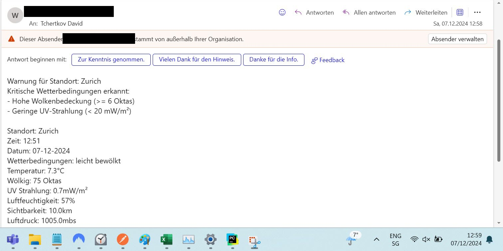
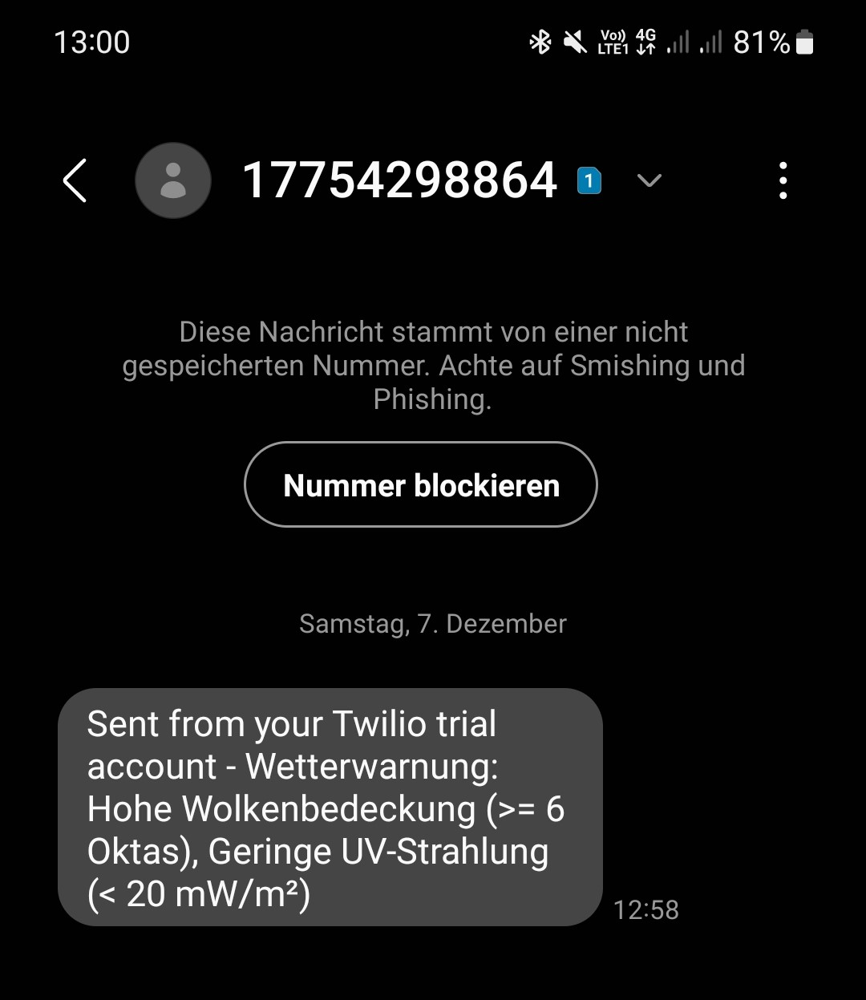{ width=600px }


# Azure

Das erste was ich mit mein Azure Konto gemacht habe, ist ein Budget Notifier.

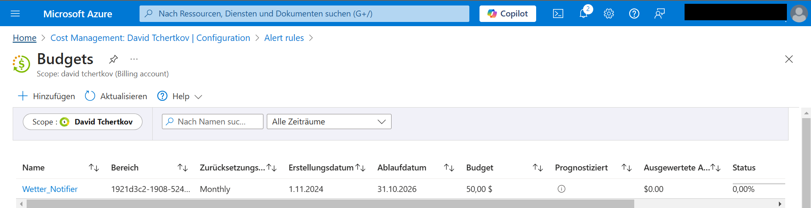

Als erstes wurde die Applikation Microsoft Azure Storage Explorer installiert, um einfacher mit dem Azure-Konto interagieren zu können. Die Verbindung mit meinem Azure-Konto wurde erfolgreich hergestellt.

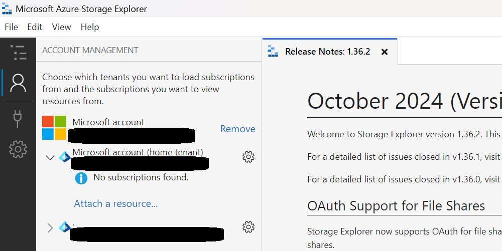

Für das Projekt wurde ein neues Azure-Abonnement mit dem Namen "Wetter_Notifier" erstellt.
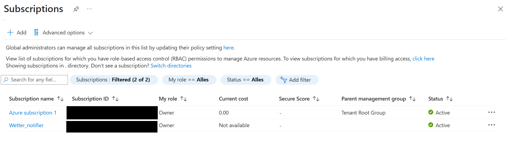

Anschliessend habe ich einen Azure Storage Table angelegt, um Benutzereinstellungen und Wetterdaten effizient zu speichern.


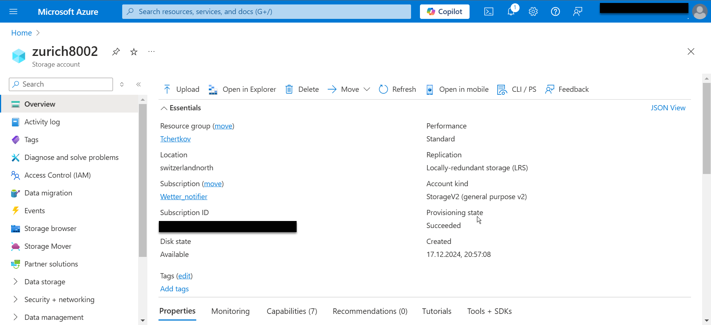
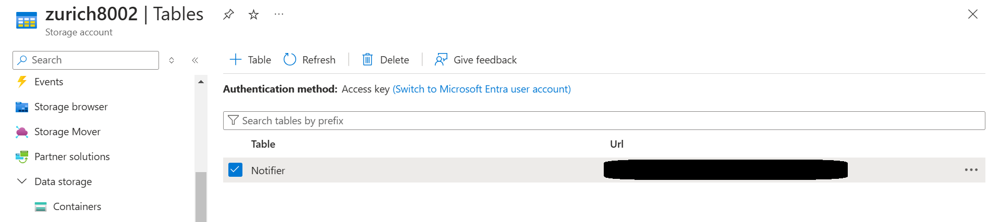

Um mit dem Azure Table Storage arbeiten zu können, wurde das Azure Data Tables SDK in der virtuellen Python-Umgebung (venv) installiert.
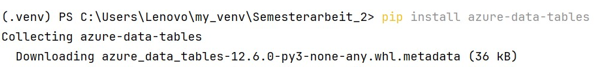

Der Storage Table wurde ausgefüllt.
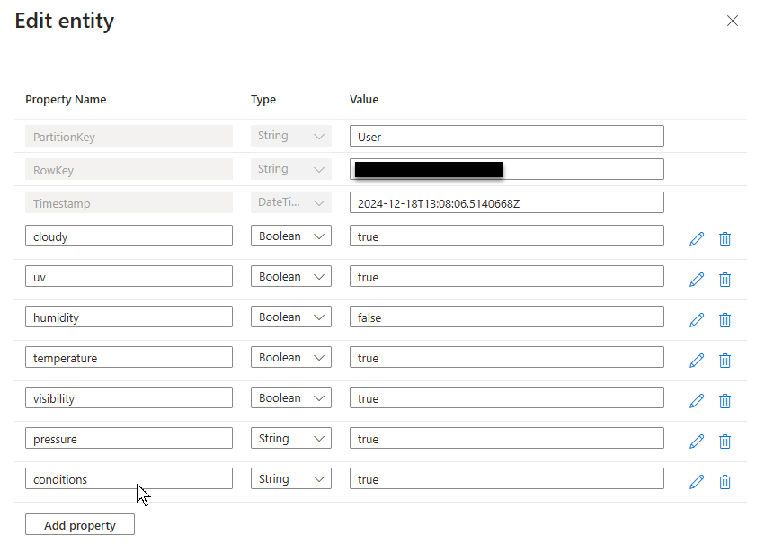

In diesem Beispiel habe ich fast alle Werte auf false gesetzt, mit Ausnahme von "conditions". Die Werte sind vom Typ Boolean. Dies habe ich durchgeführt, um zu testen, ob das Output meines Skripts die Werte dynamisch anpasst.

| PartitionKey | RowKey                          | Timestamp                     | cloudy | conditions | humidity | pressure | temperature | uv | visibility |
|--------------|---------------------------------|-------------------------------|--------|------------|----------|----------|-------------|----|------------|
| User         | xxxxxxxxxxxxxxxxxxxxxxxxxx      | 2024-12-18T17:20:09.9134606Z  | false  | true       | false    | false    | false       | false | false      |


``` python 
import datetime as dt
from datetime import datetime
import requests
import smtplib
from email.mime.text import MIMEText
from email.mime.multipart import MIMEMultipart
from requests.auth import HTTPBasicAuth
from azure.data.tables import TableServiceClient
from azure.core.credentials import AzureNamedKeyCredential

# === Azure Table Configuration ===
STORAGE_ACCOUNT_NAME = "xxxxxxxx"
STORAGE_ACCOUNT_KEY = "xxxxxxxxxxxxxxxxxxxxxxxxxxxxxxxxxxxxxxxxxxxxxxxxxxxxxxxxxxxxxxxxxxxxxxxxxxxxxxxxxxxxxxxx"
TABLE_NAME = "Notifier"
PARTITION_KEY = "User"
ROW_KEY = "xxxxxxxxxxxxxxxxxxxxxxxxxx"

# === Weather API Configuration ===
API_URL = "https://api.weatherapi.com/v1/current.json"
API_KEY = "xxxxxxxxxxxxxxxxxxxxxxxxxxxxxxx"
CITY = "Zurich"

# === Gmail Configuration ===
GMAIL_USER = "xxxxxxxxxxxxxxxxxxxxxxx"
GMAIL_PASSWORD = "xxxx xxxx xxxx xxxx"

# === Twilio Configuration ===
TWILIO_ACCOUNT_SID = "xxxxxxxxxxxxxxxxxxxxxxxxxxxxxxxxxx"
TWILIO_AUTH_TOKEN = "xxxxxxxxxxxxxxxxxxxxxxxxxxxxxxxx"
TWILIO_PHONE_NUMBER = "+17754298864"
RECIPIENT_PHONE_NUMBER = "+xxxxxxxxxxx"


def fetch_weather(api_url, api_key, city):
    params = {
        "key": api_key,
        "q": city,
        "aqi": "no",
        "lang": "de"
    }
    response = requests.get(api_url, params=params)
    response.raise_for_status()
    return response.json()


def fetch_user_preferences(storage_account_name, storage_account_key, table_name, partition_key, row_key):
    credential = AzureNamedKeyCredential(storage_account_name, storage_account_key)
    table_service = TableServiceClient(
        endpoint=f"https://xxxxxxxxx.table.core.windows.net",
        credential=credential
    )
    table_client = table_service.get_table_client(table_name=table_name)
    entity = table_client.get_entity(partition_key=partition_key, row_key=row_key)
    preferences = {
        "cloudy": entity.get("cloudy", False),
        "conditions": entity.get("conditions", False),
        "humidity": entity.get("humidity", False),
        "pressure": entity.get("pressure", False),
        "temperature": entity.get("temperature", False),
        "uv": entity.get("uv", False),
        "visibility": entity.get("visibility", False)
    }
    return preferences


def check_weather_conditions(weather_data, preferences):
    location_name = weather_data["location"]["name"]
    temperature = weather_data["current"]["temp_c"]
    weather_condition = weather_data["current"]["condition"]["text"]
    cloudy = weather_data["current"]["cloud"]
    UVS = weather_data["current"]["uv"]
    humiditys = weather_data["current"]["humidity"]
    vis_kms = weather_data["current"]["vis_km"]
    pressure_mbs = weather_data["current"]["pressure_mb"]

    reasons = []

    # Bedingungen auf der Grundlage von Benutzerpräferenzen prüfen
    if preferences["cloudy"] and cloudy >= 6:
        reasons.append("Hohe Wolkenbedeckung (>= 6 Oktas)")

    if preferences["uv"] and UVS < 20:
        reasons.append("Geringe UV-Strahlung (< 20 mW/m²)")

    if preferences["humidity"] and humiditys > 80:
        reasons.append("Hohe Luftfeuchtigkeit (> 80%)")

    if preferences["temperature"] and (temperature < -5 or temperature > 40):
        reasons.append("Extreme Temperaturen (< -5°C oder > 40°C)")

    if preferences["visibility"] and vis_kms < 2:
        reasons.append("Geringe Sichtbarkeit (< 2 km)")

    if preferences["pressure"] and pressure_mbs < 980:
        reasons.append("Niedriger Luftdruck (< 980 mbs)")

    if preferences["conditions"] and weather_condition in ["Rain", "Snow", "Thunderstorm"]:
        reasons.append(f"Schlechtes Wetter ({weather_condition})")

    return location_name, reasons


def format_email_content(location_name, reasons, weather_data, preferences):
    temperature = weather_data["current"]["temp_c"]
    weather_condition = weather_data["current"]["condition"]["text"]
    cloudy = weather_data["current"]["cloud"]
    UVS = weather_data["current"]["uv"]
    humiditys = weather_data["current"]["humidity"]
    vis_kms = weather_data["current"]["vis_km"]
    pressure_mbs = weather_data["current"]["pressure_mb"]

    local_time = weather_data["location"]["localtime"]
    time_format = datetime.strptime(local_time, "%Y-%m-%d %H:%M")
    formatted_time = time_format.strftime("%H:%M")
    formatted_date = time_format.strftime("%d-%m-%Y")

    if reasons:
        reasons_str = '- ' + '\n- '.join(reasons)
        warning_header = "Kritische Wetterbedingungen erkannt:"
    else:
        reasons_str = "Keine kritischen Wetterbedingungen erkannt."
        warning_header = ""

    content_lines = [
        f"Warnung für Standort: {location_name}",
        warning_header,
        reasons_str,
        "",
        f"Standort: {location_name}",
        f"Zeit: {formatted_time}",
        f"Datum: {formatted_date}",
        f"Wetterbedingungen: {weather_condition}"
    ]

    # Hinzufügen von Datenfeldern auf der Grundlage von Benutzerpräferenzen
    if preferences["temperature"]:
        content_lines.append(f"Temperatur: {temperature}°C")
    if preferences["cloudy"]:
        content_lines.append(f"Wölkig: {cloudy} Oktas")
    if preferences["uv"]:
        content_lines.append(f"UV Strahlung: {UVS}mW/m²")
    if preferences["humidity"]:
        content_lines.append(f"Luftfeuchtigkeit: {humiditys}%")
    if preferences["visibility"]:
        content_lines.append(f"Sichtbarkeit: {vis_kms}km")
    if preferences["pressure"]:
        content_lines.append(f"Luftdruck: {pressure_mbs}mbs")

    return "\n".join(content_lines)


def send_email(recipient_email, subject, content):
    try:
        message = MIMEMultipart()
        message["From"] = GMAIL_USER
        message["To"] = recipient_email
        message["Subject"] = subject
        message.attach(MIMEText(content, "plain"))

        with smtplib.SMTP("smtp.gmail.com", 587) as server:
            server.starttls()
            server.login(GMAIL_USER, GMAIL_PASSWORD)
            server.sendmail(GMAIL_USER, recipient_email, message.as_string())
            print(f"E-Mail erfolgreich an {recipient_email} gesendet.")
    except Exception as e:
        print(f"Fehler beim Senden der E-Mail: {e}")


def send_sms(body):
    url = f"https://api.twilio.com/2010-04-01/Accounts/{TWILIO_ACCOUNT_SID}/Messages.json"
    data = {
        "Body": body,
        "From": TWILIO_PHONE_NUMBER,
        "To": RECIPIENT_PHONE_NUMBER
    }
    response = requests.post(url, data=data, auth=HTTPBasicAuth(TWILIO_ACCOUNT_SID, TWILIO_AUTH_TOKEN))
    if response.status_code == 201:
        print(f"SMS erfolgreich gesendet! SID: {response.json()['sid']}")
    else:
        print(f"Fehler beim Senden der SMS. Statuscode: {response.status_code}")
        print("Fehlermeldung:", response.text)


if __name__ == "__main__":
    preferences = fetch_user_preferences(STORAGE_ACCOUNT_NAME, STORAGE_ACCOUNT_KEY, TABLE_NAME, PARTITION_KEY, ROW_KEY)
    weather_data = fetch_weather(API_URL, API_KEY, CITY)
    location_name, reasons = check_weather_conditions(weather_data, preferences)

    # Always format and send the email, regardless of critical conditions
    email_content = format_email_content(location_name, reasons, weather_data, preferences)
    send_email("xxxxxxxxxxxxxxxxxxxxxxxxxx", "Wetterwarnung", email_content)

  


``` 

Im Output des Skripts werden ausschliesslich die Wetterbedingungen angezeigt, die zuvor in der Azure Storage Table konfiguriert wurden. Dabei bleiben Datum, Uhrzeit und Standort stets sichtbar und unveränderlich. Diese Informationen sind essenziell und sollen sicherstellen, dass sie nicht versehentlich deaktiviert werden können. Dadurch bleibt gewährleistet, dass das Skript dynamisch an die Anpassungen in der Azure Storage Table gekoppelt ist.


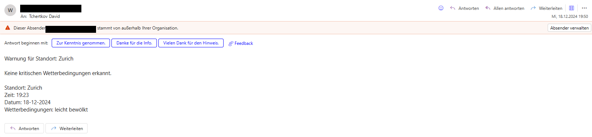

# Matplotlib
Ich habe jetzt eine Statistik in mein Skript integriert, die mit Matplotlib visualisiert wird.
Als erstes habe ich ein pip install gemacht.


``` python
pip install matplotlib
``` 

Hier ist mein angepasster Skript mit der Statistik funktion.

``` python
import pandas as pd
import matplotlib.pyplot as plt
import plotly.express as px
import plotly.graph_objects as go
from azure.data.tables import TableServiceClient
from azure.core.credentials import AzureNamedKeyCredential
from datetime import datetime

# ----- Azure Table Config -----
STORAGE_ACCOUNT_NAME = "xxxxxxxxxx"
STORAGE_ACCOUNT_KEY = "xxxxxxxxxxxxxxxxxxxxxxxxxxxxxxxxxxxxxxxxxxxxxxxxxxxxxxx"
TABLE_NAME = "xxxxxxxxxxxx"

def fetch_table_entities(account_name, account_key, table_name):
    """
    Connect to Azure Table Storage and return all entities from the given table as a list.
    """
    credential = AzureNamedKeyCredential(account_name, account_key)
    table_service = TableServiceClient(
        endpoint=f"https://xxxxxxxxxx.table.core.windows.net",
        credential=credential
    )
    table_client = table_service.get_table_client(table_name=table_name)
    return list(table_client.list_entities())

def create_dataframe(entities):
    """
    Convert the list of Azure Table entities into a Pandas DataFrame.
    """
    df = pd.DataFrame(entities)

    # If you used datetime.utcnow().isoformat() as RowKey, parse it to datetime
    if "RowKey" in df.columns:
        df["RowKey"] = pd.to_datetime(df["RowKey"], errors="coerce")

    # Sort by time (RowKey) if it’s a datetime
    if "RowKey" in df.columns:
        df.sort_values("RowKey", inplace=True)

    return df

def plot_all_metrics_matplotlib(df):
    """
    Plot multiple metrics (Temperature, Humidity, Cloud, Pressure, UV, Visibility)
    as separate subplots using Matplotlib.
    """
    # List the columns you want to plot and the labels to display
    columns_to_plot = {
        "Temperature": "Temperature (°C)",
        "Humidity": "Humidity (%)",
        "Cloud": "Cloud Coverage (%)",
        "Pressure": "Pressure (mb)",
        "UV": "UV Index",
        "Visibility": "Visibility (km)"
    }

    # Filter to columns that actually exist in df
    existing_cols = [col for col in columns_to_plot if col in df.columns]
    if not existing_cols:
        print("No recognized weather metric columns found in the DataFrame.")
        return

    # Create subplots: one per metric
    n = len(existing_cols)
    fig, axes = plt.subplots(n, 1, figsize=(10, 4 * n), sharex=True)

    # If there is only 1 metric, axes won't be a list, so make it into a list
    if n == 1:
        axes = [axes]

    for i, col in enumerate(existing_cols):
        axes[i].plot(df["RowKey"], df[col], marker='o')
        axes[i].set_ylabel(columns_to_plot[col], fontsize=10)
        axes[i].grid(True)

    axes[-1].set_xlabel("Date / Time (UTC)", fontsize=10)
    plt.suptitle("All Metrics Over Time (Matplotlib)", fontsize=14)
    plt.tight_layout()
    plt.show()

def plot_all_metrics_plotly(df):
    """
    Plot multiple metrics as lines in a single interactive chart using Plotly.
    """
    columns_to_plot = {
        "Temperature": "Temperature (°C)",
        "Humidity": "Humidity (%)",
        "Cloud": "Cloud Coverage (%)",
        "Pressure": "Pressure (mb)",
        "UV": "UV Index",
        "Visibility": "Visibility (km)"
    }
    existing_cols = [col for col in columns_to_plot if col in df.columns]
    if not existing_cols:
        print("No recognized weather metric columns found in the DataFrame.")
        return

    # Create Plotly figure with multiple traces
    fig = go.Figure()
    for col in existing_cols:
        fig.add_trace(go.Scatter(
            x=df["RowKey"],
            y=df[col],
            mode='lines+markers',
            name=columns_to_plot[col]
        ))

    fig.update_layout(
        title="All Metrics Over Time (Plotly)",
        xaxis_title="Date / Time (UTC)",
        yaxis_title="Value",
        legend_title="Metrics",
        template="plotly_white"
    )
    fig.show()

if __name__ == "__main__":
    # 1) Fetch data from Azure Table
    entities = fetch_table_entities(STORAGE_ACCOUNT_NAME, STORAGE_ACCOUNT_KEY, TABLE_NAME)
    if not entities:
        print("No entities found in table. Exiting.")
        exit()

    # 2) Convert to DataFrame
    df_weather = create_dataframe(entities)
    print("DataFrame loaded. Columns:", df_weather.columns.tolist())

    # 3) Plot all metrics with Matplotlib
    plot_all_metrics_matplotlib(df_weather)

    # 4) Plot all metrics with Plotly (interactive)
    plot_all_metrics_plotly(df_weather)

    print("Done.")

```
Hier kann man den Output des Skripts sehen.
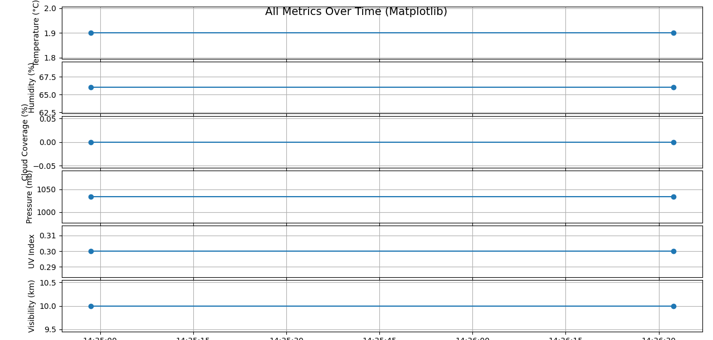

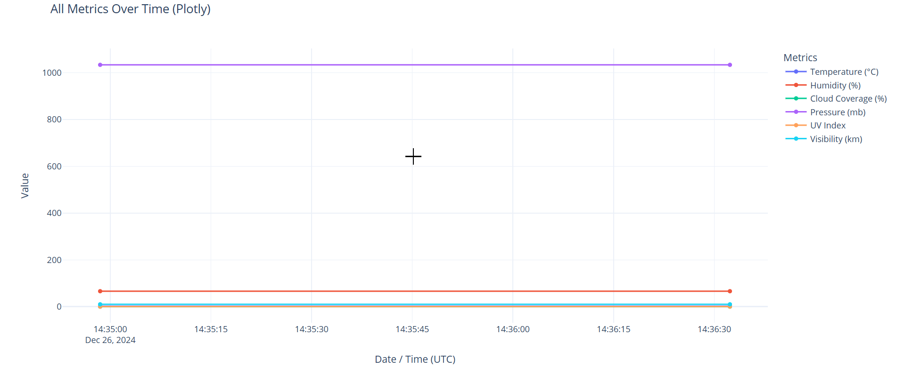

# Azure Function App
Zum Abschluss habe ich eine Azure Function App erstellt. Ich habe dies zuletzt umgesetzt, da ich zunächst Schwierigkeiten hatte, die Implementierung erfolgreich durchzuführen.

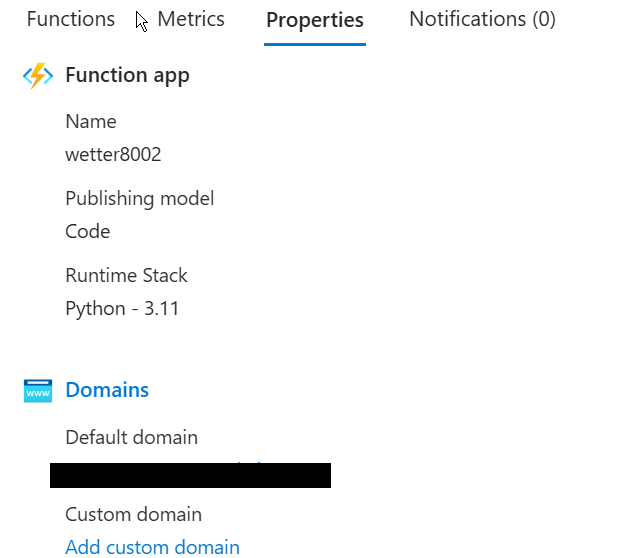{ width=300px }

Im Terminal habe ich die function initialisiert.
```
func init weather_notifier --python
```
Dann wurde ein Time Trigger erstellt.
```
func new --name DailyWeatherCheck --template "Timer trigger" --language python
```

Als es erstellt wurde habe ich im **function_app.py** diese configuration implementiert.

```
import azure.functions as func
import datetime
import json
import logging

app = func.FunctionApp()


@app.schedule(schedule="30 5 * * *", arg_name="myTimer", run_on_startup=False,
              use_monitor=True)  # 05:30 AM daily
def DailyWeatherCheck(myTimer: func.TimerRequest) -> None:
    if myTimer.past_due:
        logging.warning('The timer is running late!')

    logging.info('Timer triggered at %s', datetime.datetime.utcnow())

    # Call your main logic here
    import Main
    Main.main()
```
Hier wird der **local.settings.json** aktualisiert.

```json
{
  "IsEncrypted": false,
  "Values": {
    // This is the real Azure storage connection string
    "AzureWebJobsStorage": "DefaultEndpointsProtocol=https;AccountName=xxxxxxxxx;AccountKey=xxxxxxxxxxxxxxxxxxxxxxxxxxxxxxxxxxxxxxxxxxxxxxxxxxxxxxxxxxxxxxxxxxxxxxxxxxxxxxxxxxxxxxxx;EndpointSuffix=core.windows.net",
    "FUNCTIONS_WORKER_RUNTIME": "python",

    // Additional environment variables your code needs
    "STORAGE_ACCOUNT_NAME": "xxxxxxxxx",
    "STORAGE_ACCOUNT_KEY": "xxxxxxxxxxxxxxxxxxxxxxxxxxxxxxxxxxxxxxxxxxxxxxxxxxxxxxxxxxxxxxxxxxxxxxxxxxxxxxxxxxxxxxxx",
    "WEATHER_API_KEY": "xxxxxxxxxxxxxxxxxxxxxxxxxxxxxxx",
    "GMAIL_USER": "xxxxxxxxxxxxxxxxxxxxxxxxxx",
    "GMAIL_PASSWORD": "xxxx xxxx xxxx xxxx",
    "TWILIO_ACCOUNT_SID": "xxxxxxxxxxxxxxxxxxxxxxxxxxxxxxxxxxxx",
    "TWILIO_AUTH_TOKEN": "xxxxxxxxxxxxxxxxxxxxxxxxxxxxxxxxx",
    "TWILIO_PHONE_NUMBER": "+17754298864",
    "RECIPIENT_PHONE_NUMBER": "+xxxxxxxxxxx",
    "EMAIL_RECIPIENT": "xxxxxxxxxxxxxxxxxxxxxxxxxx"
  }
}
```


Nachdem wurde der Python Skript angepasst.

```python
import os
import datetime as dt
from datetime import datetime

import requests
from requests.auth import HTTPBasicAuth
import smtplib
from email.mime.text import MIMEText
from email.mime.multipart import MIMEMultipart

import pandas as pd
import matplotlib.pyplot as plt
import plotly.express as px

from azure.data.tables import TableServiceClient, TableEntity
from azure.core.credentials import AzureNamedKeyCredential

# -----------------------------------------------------------------
#  1) READ ENVIRONMENT VARIABLES
# -----------------------------------------------------------------
STORAGE_ACCOUNT_NAME = os.getenv("xxxxxxxxx")  
STORAGE_ACCOUNT_KEY = os.getenv("xxxxxxxxxxxxxxxxxxxxxxxxxxxxxxxxxxxxxxxxxxxxxxxxxxxxxxxxxxxxxxxxxxxxxxxxxxxxxxxxxxxxxxxx")
API_KEY = os.getenv("xxxxxxxxxxxxxxxxxxxxxxxxxxxxxxx")
GMAIL_PASSWORD = os.getenv("xxxx xxxx xxxx xxxx")
TWILIO_ACCOUNT_SID = os.getenv("xxxxxxxxxxxxxxxxxxxxxxxxxxxxxxxxx")
TWILIO_AUTH_TOKEN = os.getenv("xxxxxxxxxxxxxxxxxxxxxxxxxxxxxxxx")
TWILIO_PHONE_NUMBER = os.getenv("+17754298864")
RECIPIENT_PHONE_NUMBER = os.getenv("+xxxxxxxxxxx")
EMAIL_RECIPIENT = os.getenv("xxxxxxxxxxxxxxxxxxxxxxxxxx")

TABLE_NAME_STATISTICS = "xxxxxxxxxxxxx"
API_URL = "https://api.weatherapi.com/v1/current.json"
CITY = "Zurich"

# -----------------------------------------------------------------
#  2) FETCH WEATHER
# -----------------------------------------------------------------
def fetch_weather(api_url, api_key, city):
    """
    Fetch current weather data from the WeatherAPI.
    """
    params = {
        "key": api_key,
        "q": city,
        "aqi": "no",
        "lang": "de"
    }
    response = requests.get(api_url, params=params)
    response.raise_for_status()
    return response.json()

# -----------------------------------------------------------------
#  3) CHECK CONDITIONS
# -----------------------------------------------------------------
def check_weather_conditions(weather_data):
    """
    Determines if notification (bad weather) is needed based on thresholds.
    Returns (notification_needed: bool, reasons: list_of_strings).
    """
    temperature = weather_data["current"]["temp_c"]
    weather_condition = weather_data["current"]["condition"]["text"]
    cloudy = weather_data["current"]["cloud"]
    UVS = weather_data["current"]["uv"]
    humiditys = weather_data["current"]["humidity"]
    vis_kms = weather_data["current"]["vis_km"]
    pressure_mbs = weather_data["current"]["pressure_mb"]

    reasons = []

    # Example criteria:
    if cloudy >= 6:
        reasons.append("Hohe Wolkenbedeckung (>= 6 Oktas)")
    if UVS < 20:
        reasons.append("Geringe UV-Strahlung (< 20 mW/m²)")
    if humiditys > 80:
        reasons.append("Hohe Luftfeuchtigkeit (> 80%)")
    if temperature < -5 or temperature > 40:
        reasons.append("Extreme Temperaturen (< -5°C oder > 40°C)")
    if vis_kms < 2:
        reasons.append("Geringe Sichtbarkeit (< 2 km)")
    if pressure_mbs < 980:
        reasons.append("Niedriger Luftdruck (< 980 mbs)")
    if weather_condition in ["Rain", "Snow", "Thunderstorm"]:
        reasons.append(f"Schlechtes Wetter ({weather_condition})")

    notification_needed = (len(reasons) > 0)
    return notification_needed, reasons

# -----------------------------------------------------------------
#  4) EMAIL + SMS
# -----------------------------------------------------------------
def format_email_content(weather_data, reasons):
    """
    Builds the email text with weather details and reasons.
    """
    location_name = weather_data["location"]["name"]
    temperature = weather_data["current"]["temp_c"]
    weather_condition = weather_data["current"]["condition"]["text"]
    cloudy = weather_data["current"]["cloud"]
    UVS = weather_data["current"]["uv"]
    humiditys = weather_data["current"]["humidity"]
    vis_kms = weather_data["current"]["vis_km"]
    pressure_mbs = weather_data["current"]["pressure_mb"]

    local_time = weather_data["location"]["localtime"]
    time_format = datetime.strptime(local_time, "%Y-%m-%d %H:%M")
    formatted_time = time_format.strftime("%H:%M")
    formatted_date = time_format.strftime("%d-%m-%Y")

    reasons_str = '- ' + '\n- '.join(reasons)

    content = (
        f"Warnung für Standort: {location_name}\n"
        f"Kritische Wetterbedingungen erkannt:\n"
        f"{reasons_str}\n\n"
        f"Standort: {location_name}\n"
        f"Zeit: {formatted_time}\n"
        f"Datum: {formatted_date}\n"
        f"Wetterbedingungen: {weather_condition}\n"
        f"Temperatur: {temperature}°C\n"
        f"Wölkig: {cloudy} Oktas\n"
        f"UV Strahlung: {UVS} mW/m²\n"
        f"Luftfeuchtigkeit: {humiditys}%\n"
        f"Sichtbarkeit: {vis_kms} km\n"
        f"Luftdruck: {pressure_mbs} mbs\n"
    )
    return content

def send_email(subject, content):
    """
    Sends an email using Gmail SMTP.
    """
    try:
        if not (GMAIL_USER and GMAIL_PASSWORD and EMAIL_RECIPIENT):
            print("Skipping email – GMAIL_USER, GMAIL_PASSWORD, or EMAIL_RECIPIENT not set.")
            return

        message = MIMEMultipart()
        message["From"] = GMAIL_USER
        message["To"] = EMAIL_RECIPIENT
        message["Subject"] = subject
        message.attach(MIMEText(content, "plain"))

        with smtplib.SMTP("smtp.gmail.com", 587) as server:
            server.starttls()
            server.login(GMAIL_USER, GMAIL_PASSWORD)
            server.sendmail(GMAIL_USER, EMAIL_RECIPIENT, message.as_string())
            print(f"E-Mail erfolgreich an {EMAIL_RECIPIENT} gesendet.")
    except Exception as e:
        print(f"Fehler beim Senden der E-Mail: {e}")

def send_sms(body):
    """
    Sends an SMS using Twilio.
    """
    if not (TWILIO_ACCOUNT_SID and TWILIO_AUTH_TOKEN and TWILIO_PHONE_NUMBER and RECIPIENT_PHONE_NUMBER):
        print("Skipping SMS – Twilio credentials or phone numbers not set.")
        return

    url = f"https://api.twilio.com/2010-04-01/Accounts/{TWILIO_ACCOUNT_SID}/Messages.json"
    data = {
        "Body": body,
        "From": TWILIO_PHONE_NUMBER,
        "To": RECIPIENT_PHONE_NUMBER
    }
    response = requests.post(url, data=data, auth=HTTPBasicAuth(TWILIO_ACCOUNT_SID, TWILIO_AUTH_TOKEN))
    if response.status_code == 201:
        print(f"SMS erfolgreich gesendet! SID: {response.json()['sid']}")
    else:
        print(f"Fehler beim Senden der SMS. Statuscode: {response.status_code}")
        print("Fehlermeldung:", response.text)

# -----------------------------------------------------------------
#  5) STORE IN AZURE TABLE
# -----------------------------------------------------------------
def store_weather_for_statistics(weather_data, city):
    """
    Saves the current weather data into Azure Table 'WetterStatistik'.
    """
    if not (STORAGE_ACCOUNT_NAME and STORAGE_ACCOUNT_KEY):
        print("Skipping storing weather – STORAGE_ACCOUNT_NAME or STORAGE_ACCOUNT_KEY not set.")
        return

    credential = AzureNamedKeyCredential(STORAGE_ACCOUNT_NAME, STORAGE_ACCOUNT_KEY)
    table_service = TableServiceClient(
        endpoint=f"https://xxxxxxxx.table.core.windows.net",
        credential=credential
    )

    table_service.create_table_if_not_exists(TABLE_NAME_STATISTICS)
    table_client = table_service.get_table_client(TABLE_NAME_STATISTICS)

    entity = TableEntity()
    entity["PartitionKey"] = city
    entity["RowKey"] = datetime.utcnow().isoformat()  # unique
    entity["Temperature"] = weather_data["current"]["temp_c"]
    entity["Condition"] = weather_data["current"]["condition"]["text"]
    entity["Cloud"] = weather_data["current"]["cloud"]
    entity["UV"] = weather_data["current"]["uv"]
    entity["Humidity"] = weather_data["current"]["humidity"]
    entity["Visibility"] = weather_data["current"]["vis_km"]
    entity["Pressure"] = weather_data["current"]["pressure_mb"]

    table_client.create_entity(entity)
    print("Wetterdaten in Azure Table 'WetterStatistik' gespeichert.")

# -----------------------------------------------------------------
#  6) VISUALIZE (OPTIONAL) – Matplotlib / Plotly
# -----------------------------------------------------------------
def fetch_all_weather_entities():
    if not (STORAGE_ACCOUNT_NAME and STORAGE_ACCOUNT_KEY):
        return []

    credential = AzureNamedKeyCredential(STORAGE_ACCOUNT_NAME, STORAGE_ACCOUNT_KEY)
    table_service = TableServiceClient(
        endpoint=f"https://xxxxxxxxx.table.core.windows.net",
        credential=credential
    )
    table_client = table_service.get_table_client(TABLE_NAME_STATISTICS)
    return list(table_client.list_entities())

def make_dataframe(entities):
    df = pd.DataFrame(entities)
    if "RowKey" in df.columns:
        df["RowKey"] = pd.to_datetime(df["RowKey"], errors="coerce")
        df.sort_values("RowKey", inplace=True)
    return df

def plot_matplotlib(df):
    plt.figure(figsize=(10, 6))
    if "Temperature" in df.columns:
        plt.plot(df["RowKey"], df["Temperature"], marker='o', label="Temperature (°C)")
    if "Humidity" in df.columns:
        plt.plot(df["RowKey"], df["Humidity"], marker='x', label="Humidity (%)")
    if "UV" in df.columns:
        plt.plot(df["RowKey"], df["UV"], marker='s', label="UV Index")

    plt.title("Weather Metrics Over Time (Matplotlib)")
    plt.xlabel("Date/Time (UTC)")
    plt.ylabel("Value")
    plt.legend()
    plt.grid(True)
    plt.tight_layout()
    plt.show()

def plot_plotly(df):
    metrics = []
    if "Temperature" in df.columns:
        metrics.append("Temperature")
    if "Humidity" in df.columns:
        metrics.append("Humidity")
    if "UV" in df.columns:
        metrics.append("UV")

    if not metrics:
        print("No recognized columns for Plotly chart.")
        return

    fig = px.line(df, x="RowKey", y=metrics, title="Weather Metrics Over Time (Plotly)")
    fig.update_layout(
        xaxis_title="Date/Time (UTC)",
        yaxis_title="Value",
        legend_title="Metric"
    )
    fig.show()

# -----------------------------------------------------------------
#  7) AZURE FUNCTION ENTRY POINT
# -----------------------------------------------------------------
def main(myTimer):
    """
    Azure Functions timer-triggered entry point.
    Runs automatically at the schedule defined in function.json (05:30 daily).
    """
    print("[Azure Function] Timer Triggered")

    # 1) Get current weather
    weather_data = fetch_weather(API_URL, API_KEY, CITY)
    print("Aktuelles Wetter abgerufen.")

    # 2) Check conditions
    notification_needed, reasons = check_weather_conditions(weather_data)

    # 3) If bad weather, send email & SMS
    if notification_needed:
        email_content = format_email_content(weather_data, reasons)
        send_email("Wetterwarnung", email_content)

        sms_content = "Wetterwarnung: " + "; ".join(reasons)
        send_sms(sms_content)
    else:
        print("Keine kritischen Wetterbedingungen erkannt.")

    # 4) Store in Azure Table
    store_weather_for_statistics(weather_data, CITY)


```
