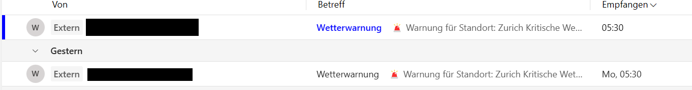
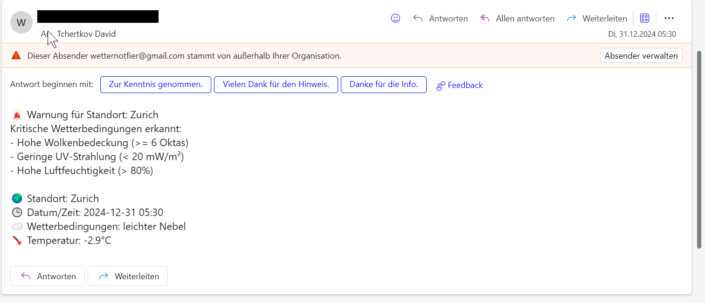
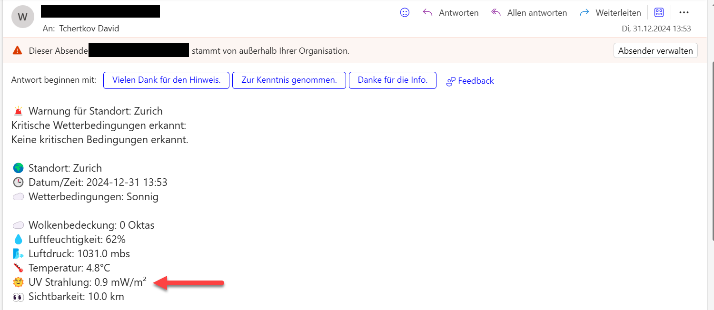
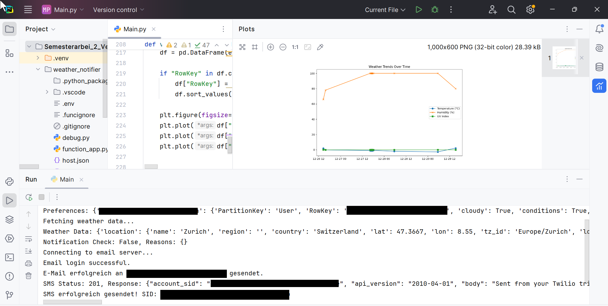
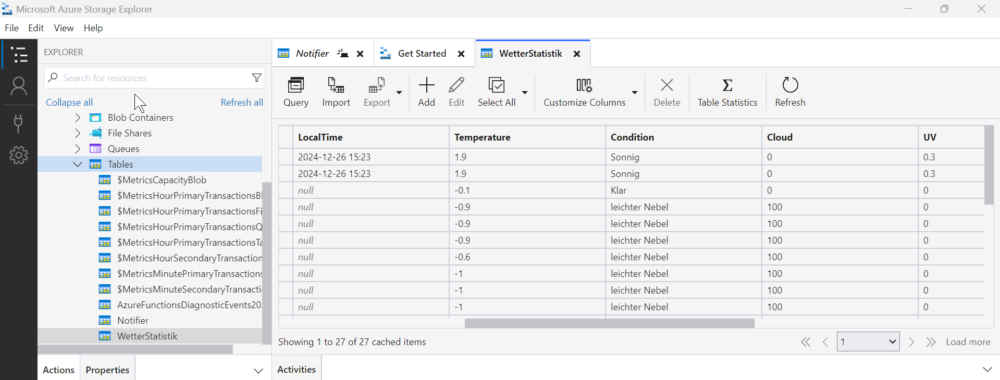
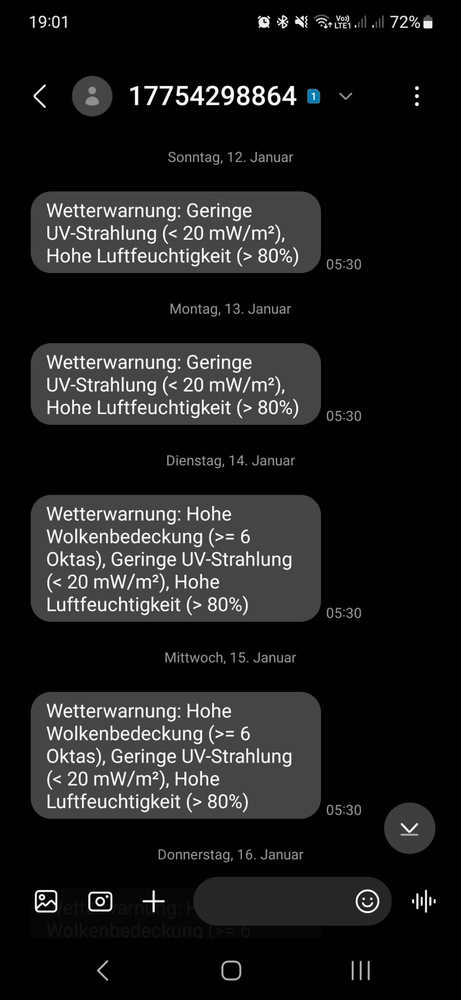

# Zusammenfassung meines Projektes
[[_TOC_]]


# Python Skript
Mein Python-Skript wurde in PyCharm entwickelt, wobei alle relevanten Dateien innerhalb des Projekts gespeichert sind. Zur Laufzeitumgebung nutze ich eine virtuelle Umgebung (VENV). Sämtliche sensiblen Daten sind sicher in einer .env-Datei hinterlegt.

**.ENV Datei**
```
STORAGE_ACCOUNT_NAME=xxxxxxxxx
STORAGE_ACCOUNT_KEY=xxxxxxxxxxxxxxxxxxxxxxxxxxxxxxxxxxxxxxxxxxxxxxxxxxxxxxxxxxxxxxxxxxxxxxxxxxxxxxxxx
API_KEY=xxxxxxxxxxxxxxxxxxxxxxxxxxxxx
GMAIL_USER=xxxxxxxxxxxxxxxxxxxxxxxx
GMAIL_PASSWORD=xxxx xxxx xxxx xxxx
EMAIL_RECIPIENT=dxxxxxxxxxxxxxxxxxxxxxxxxxxx
TWILIO_ACCOUNT_SID=xxxxxxxxxxxxxxxxxxxxxxxxxxxxxxxxxxxxx
TWILIO_AUTH_TOKEN=xxxxxxxxxxxxxxxxxxxxxxxxxxxxxxxxxx
TWILIO_PHONE_NUMBER=+17754298864
RECIPIENT_PHONE_NUMBER=+xxxxxxxxxxx

```
Hier ist der Skript denn ich für mein Projekt erstellt habe.<br>
**Main.py**

``` python 
import os
from datetime import datetime
from dotenv import load_dotenv
import requests
from requests.auth import HTTPBasicAuth
import smtplib
from email.mime.text import MIMEText
from email.mime.multipart import MIMEMultipart
import pandas as pd
import matplotlib.pyplot as plt
import plotly.express as px

from azure.data.tables import TableServiceClient
from azure.core.credentials import AzureNamedKeyCredential

# -----------------------------------------------------------------
#  1) READ ENVIRONMENT VARIABLES
# -----------------------------------------------------------------
load_dotenv()

STORAGE_ACCOUNT_NAME = os.getenv("STORAGE_ACCOUNT_NAME", "xxxxxxxxxxxx")
STORAGE_ACCOUNT_KEY = os.getenv("STORAGE_ACCOUNT_KEY", "xxxxxxxxxxx")
API_KEY = os.getenv("API_KEY", "your_api_key")

GMAIL_USER = os.getenv("GMAIL_USER")
GMAIL_PASSWORD = os.getenv("GMAIL_PASSWORD")
EMAIL_RECIPIENT = os.getenv("EMAIL_RECIPIENT")

# Twilio Configuration
TWILIO_ACCOUNT_SID = os.getenv("TWILIO_ACCOUNT_SID")
TWILIO_AUTH_TOKEN = os.getenv("TWILIO_AUTH_TOKEN")
TWILIO_PHONE_NUMBER = os.getenv("TWILIO_PHONE_NUMBER")
RECIPIENT_PHONE_NUMBER = os.getenv("RECIPIENT_PHONE_NUMBER")

TABLE_NAME_STATISTICS = "WetterStatistik"
TABLE_NAME_PREFERENCES = "Notifier"
API_URL = "https://api.weatherapi.com/v1/current.json"
CITY = "Zurich"


# -----------------------------------------------------------------
#  2) FETCH WEATHER
# -----------------------------------------------------------------
def fetch_weather(api_url, api_key, city):
    params = {
        "key": api_key,
        "q": city,
        "aqi": "no",
        "lang": "de"
    }
    response = requests.get(api_url, params=params)
    response.raise_for_status()
    return response.json()


# -----------------------------------------------------------------
#  3) FETCH PREFERENCES FROM AZURE TABLE
# -----------------------------------------------------------------
def fetch_preferences_from_table():
    credential = AzureNamedKeyCredential(STORAGE_ACCOUNT_NAME, STORAGE_ACCOUNT_KEY)
    table_service = TableServiceClient(
        endpoint=f"https://{STORAGE_ACCOUNT_NAME}.table.core.windows.net",
        credential=credential
    )
    table_client = table_service.get_table_client(TABLE_NAME_PREFERENCES)

    preferences = {}
    entities = list(table_client.list_entities())

    for entity in entities:
        preferences[entity["RowKey"]] = entity

    return preferences


# -----------------------------------------------------------------
#  4) CHECK CONDITIONS BASED ON PREFERENCES
# -----------------------------------------------------------------
def check_weather_conditions(weather_data, preferences):
    temperature = weather_data["current"]["temp_c"]
    weather_condition = weather_data["current"]["condition"]["text"]
    cloudy = weather_data["current"]["cloud"]
    UVS = weather_data["current"]["uv"]
    humiditys = weather_data["current"]["humidity"]
    vis_kms = weather_data["current"]["vis_km"]
    pressure_mbs = weather_data["current"]["pressure_mb"]

    user_prefs = preferences.get(EMAIL_RECIPIENT, {})

    reasons = {}

    # Check each condition dynamically
    if user_prefs.get("cloudy", "false") == "true" and cloudy >= 6:
        reasons["Hohe Wolkenbedeckung (>= 6 Oktas)"] = True
    if user_prefs.get("uv", "false") == "true" and UVS < 20:
        reasons["Geringe UV-Strahlung (< 20 mW/m²)"] = True
    if user_prefs.get("humidity", "false") == "true" and humiditys > 80:
        reasons["Hohe Luftfeuchtigkeit (> 80%)"] = True
    if user_prefs.get("temperature", "false") == "true" and (temperature < -5 or temperature > 40):
        reasons["Extreme Temperaturen (< -5°C oder > 40°C)"] = True
    if user_prefs.get("visibility", "false") == "true" and vis_kms < 2:
        reasons["Geringe Sichtbarkeit (< 2 km)"] = True
    if user_prefs.get("pressure", "false") == "true" and pressure_mbs < 980:
        reasons["Niedriger Luftdruck (< 980 mbs)"] = True
    if user_prefs.get("conditions", "false") == "true" and weather_condition in ["Rain", "Snow", "Thunderstorm"]:
        reasons[f"Schlechtes Wetter ({weather_condition})"] = True

    notification_needed = len(reasons) > 0
    return notification_needed, reasons


# -----------------------------------------------------------------
#  5) EMAIL + SMS
# -----------------------------------------------------------------
def format_email_content(weather_data, filtered_conditions):
    location_name = weather_data["location"]["name"]
    temp = weather_data["current"]["temp_c"]
    weather_condition = weather_data["current"]["condition"]["text"]
    local_time = weather_data["location"]["localtime"]

    # Extract weather data from the API response
    current_weather = weather_data["current"]

    # Fetch user preferences from Azure table
    user_prefs = fetch_preferences_from_table().get(EMAIL_RECIPIENT, {})

    # Map weather API fields to table preferences
    weather_mapping = {
        "cloudy": f"☁️ Wolkenbedeckung: {current_weather['cloud']} Oktas",
        "uv": f"🌞 UV Strahlung: {current_weather['uv']} mW/m²",
        "humidity": f"💧 Luftfeuchtigkeit: {current_weather['humidity']}%",
        "visibility": f"👀 Sichtbarkeit: {current_weather['vis_km']} km",
        "pressure": f"🌬️ Luftdruck: {current_weather['pressure_mb']} mbs",
        "temperature": f"🌡️ Temperatur: {temp}°C",
    }

    # Filter weather data based on `true` preferences
    filtered_weather_data = [
        weather_mapping[key]
        for key, value in user_prefs.items()
        if str(value).lower() == 'true' and key in weather_mapping
    ]

    # Build reasons for the alert
    reasons_str = '- ' + '\n- '.join(filtered_conditions.keys()) if filtered_conditions else "Keine kritischen Bedingungen erkannt."

    # Construct the email content
    content = (
        f"🚨 Warnung für Standort: {location_name}\n"
        f"Kritische Wetterbedingungen erkannt:\n"
        f"{reasons_str}\n\n"
        f"🌍 Standort: {location_name}\n"
        f"🕒 Datum/Zeit: {local_time}\n"
        f"☁️ Wetterbedingungen: {weather_condition}\n"
    )

    # Add the dynamically filtered weather data
    if filtered_weather_data:
        content += "\n" + "\n".join(filtered_weather_data)
    else:
        content += "\nKeine zusätzlichen Wetterdaten verfügbar."

    return content


def send_email(subject, content):
    try:
        with smtplib.SMTP("smtp.gmail.com", 587) as server:
            server.starttls()
            print("Connecting to email server...")
            server.login(GMAIL_USER, GMAIL_PASSWORD)
            print("Email login successful.")

            message = MIMEMultipart()
            message["From"] = GMAIL_USER
            message["To"] = EMAIL_RECIPIENT
            message["Subject"] = subject
            message.attach(MIMEText(content, "plain"))

            server.sendmail(GMAIL_USER, EMAIL_RECIPIENT, message.as_string())
            print(f"E-Mail erfolgreich an {EMAIL_RECIPIENT} gesendet.")
    except Exception as e:
        print(f"Fehler beim Senden der E-Mail: {e}")


def send_sms(body):
    if not (TWILIO_ACCOUNT_SID and TWILIO_AUTH_TOKEN and TWILIO_PHONE_NUMBER and RECIPIENT_PHONE_NUMBER):
        print("Skipping SMS – Twilio credentials or phone numbers not set.")
        return

    url = f"https://api.twilio.com/2010-04-01/Accounts/{TWILIO_ACCOUNT_SID}/Messages.json"
    data = {
        "Body": body,
        "From": TWILIO_PHONE_NUMBER,
        "To": RECIPIENT_PHONE_NUMBER
    }
    response = requests.post(url, data=data, auth=HTTPBasicAuth(TWILIO_ACCOUNT_SID, TWILIO_AUTH_TOKEN))
    print(f"SMS Status: {response.status_code}, Response: {response.text}")
    if response.status_code == 201:
        print(f"SMS erfolgreich gesendet! SID: {response.json()['sid']}")


# -----------------------------------------------------------------
#  6) STORE AND VISUALIZE WEATHER DATA
# -----------------------------------------------------------------
def visualize_weather_data():
    credential = AzureNamedKeyCredential(STORAGE_ACCOUNT_NAME, STORAGE_ACCOUNT_KEY)
    table_service = TableServiceClient(
        endpoint=f"https://{STORAGE_ACCOUNT_NAME}.table.core.windows.net",
        credential=credential
    )
    table_client = table_service.get_table_client(TABLE_NAME_STATISTICS)

    entities = list(table_client.list_entities())
    df = pd.DataFrame(entities)

    if "RowKey" in df.columns:
        df["RowKey"] = pd.to_datetime(df["RowKey"], errors="coerce")
        df.sort_values("RowKey", inplace=True)

    plt.figure(figsize=(10, 6))
    plt.plot(df["RowKey"], df["Temperature"], marker='o', label="Temperature (°C)")
    plt.plot(df["RowKey"], df["Humidity"], marker='x', label="Humidity (%)")
    plt.plot(df["RowKey"], df["UV"], marker='s', label="UV Index")
    plt.legend()
    plt.title("Weather Trends Over Time")
    plt.show()


# -----------------------------------------------------------------
#  7) MAIN
# -----------------------------------------------------------------
def main():
    print("Fetching preferences...")
    preferences = fetch_preferences_from_table()
    print(f"Preferences: {preferences}")

    print("Fetching weather data...")
    weather_data = fetch_weather(API_URL, API_KEY, CITY)
    print(f"Weather Data: {weather_data}")

    notification_needed, filtered_conditions = check_weather_conditions(weather_data, preferences)
    print(f"Notification Check: {notification_needed}, Reasons: {filtered_conditions}")

    # Format email content even if no conditions are met
    email_content = format_email_content(weather_data, filtered_conditions)

    # Send notification regardless of conditions
    send_email("Wetterupdate – Keine kritischen Bedingungen", email_content)
    send_sms(email_content)

    visualize_weather_data()


if __name__ == "__main__":
    main()

``` 

# Azure
## Azure Data Tale
Zur flexiblen Konfiguration des E-Mail- und SMS-Versands habe ich eine Azure Table Storage-Tabelle implementiert. Techniker können darüber ihre persönlichen Präferenzen festlegen und entscheiden, welche spezifischen Wetterdaten sie erhalten möchten. So lässt sich der Versand beispielsweise auf die Benachrichtigung über UV-Strahlungswerte beschränken.<br>
Das ist die Tabelle die ich in Azure erstellt habe.
| PartitionKey | RowKey                          | Timestamp                     | cloudy | conditions | humidity | pressure | temperature | uv | visibility |
|--------------|---------------------------------|-------------------------------|--------|------------|----------|----------|-------------|----|------------|
| User         | xxxxxxxxxxxxxxxxxxxxxxxxxx      | 2024-12-18T17:20:09.9134606Z  | false  | true       | false    | false    | false       | false | false      |

## Azure Functions Timer

Nachdem die grundlegende Struktur stand, habe ich eine Azure Function mit einem Timer Trigger erstellt. Dazu habe ich im PyCharm-Terminal die Azure Function App initialisiert:

```
func init weather_notifier --python
```
Anschliessend wurde die Timer-Funktion hinzugefügt:

```
func new --name DailyWeatherCheck --template "Timer trigger" --language python
```

Durch diesen Befehl wurden automatisch drei neue Dateien generiert, die von Azure bereitgestellt werden und die Grundstruktur der Function abbilden.

**host.json**
```json
  {
  "version": "2.0",
  "logging": {
    "applicationInsights": {
      "samplingSettings": {
        "isEnabled": true,
        "excludedTypes": "Request"
      }
    }
  },
  "extensionBundle": {
    "id": "Microsoft.Azure.Functions.ExtensionBundle",
    "version": "[4.*, 5.0.0)"
  }
}
```
**local.settings.json**
```
{
  "IsEncrypted": false,
  "Values": {
    // This is the real Azure storage connection string
    "AzureWebJobsStorage": "DefaultEndpointsProtocol=https;AccountName=xxxxxxxxxxxx;AccountKey=xxxxxxxxxxxxxxxxxxxxxxxxxxxxxxxxxxxxxxxxxxxxxxxxxxxxxxxxxxxxxxxxxxxxxxxxxxxx==;EndpointSuffix=core.windows.net",
    "FUNCTIONS_WORKER_RUNTIME": "python",

    // Additional environment variables your code needs
    "STORAGE_ACCOUNT_NAME": "xxxxxxxxxxxx",
    "STORAGE_ACCOUNT_KEY": "xxxxxxxxxxxxxxxxxxxxxxxxxxxxxxxxxxxxxxxxxxxxxxxxxxxxxxxxxxxxxxxxxxxxxxxxxxxxxxxxxxxxxxxxxxxxx",
    "WEATHER_API_KEY": "xxxxxxxxxxxxxxxxxxxxxxxxxxxxxxxx",
    "GMAIL_USER": "xxxxxxxxxxxxxxxxxxxxxx",
    "GMAIL_PASSWORD": "xxxx xxxx xxxx xxxx",
    "TWILIO_ACCOUNT_SID": "xxxxxxxxxxxxxxxxxxxxxxxxxxxxx",
    "TWILIO_AUTH_TOKEN": "xxxxxxxxxxxxxxxxxxxxxxxxxxxxxxxxx
    "RECIPIENT_PHONE_NUMBER": "+xxxxxxxxxxx",
    "EMAIL_RECIPIENT": "xxxxxxxxxxxxxxxxxxxxxxxx"
  }
}
```

**function_app.py**
```python
import azure.functions as func
import datetime
import json
import logging

app = func.FunctionApp()


@app.schedule(schedule="30 4 * * *", arg_name="myTimer", run_on_startup=False,
              use_monitor=True)  # 05:30 AM daily
def DailyWeatherCheck(myTimer: func.TimerRequest) -> None:
    if myTimer.past_due:
        logging.warning('The timer is running late!')

    logging.info('Timer triggered at %s', datetime.datetime.utcnow())

    # Call your main logic here
    import Main
    Main.main()
```

# Prüfung des Projekts

Der Screenshot zeigt, dass die E-Mails täglich um 05:30 Uhr erfolgreich zugestellt werden. Der Inhalt der E-Mail enthält nur die spezifischen Daten, die gemäss den Konfigurationen in der Azure Table Storage-Tabelle definiert wurden.





Ich habe die Azure Table Storage-Tabelle so angepasst, dass nun auch die UV-Strahlung erfasst und angezeigt wird. Dies ist am roten Pfeil im Screenshot ersichtlich.



Beim manuellen Ausführen des Skripts wird der Prozessablauf im Terminal angezeigt. Dies dient dazu, mögliche Fehler zu erkennen und sich im Bedarfsfall auf die Log-Dateien stützen zu können. Zusätzlich wird die Statistik grafisch dargestellt, und die Abrufe werden in Azure Table Storage gespeichert.




Hier ist ersichtlich, dass die Benachrichtigung täglich um 05:30 Uhr ausgeführt wird.<p>
{ width=300px }
